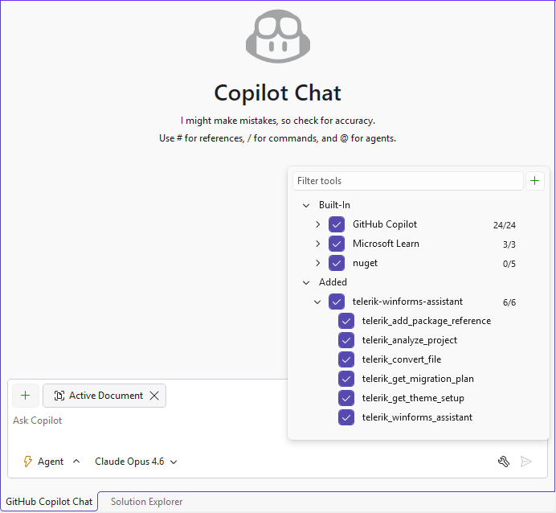
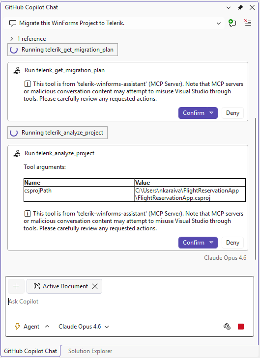
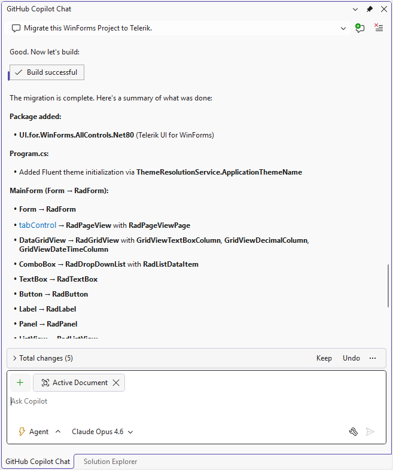
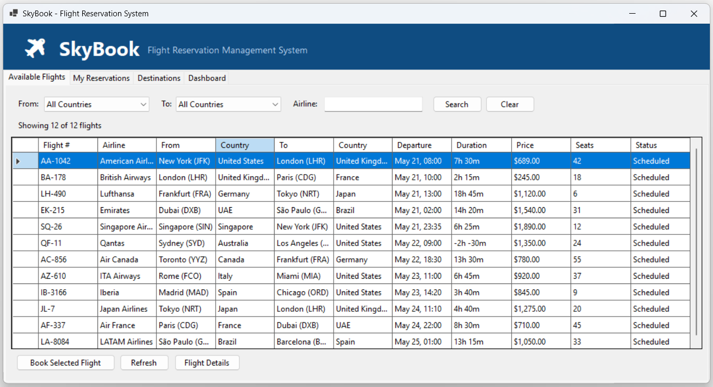
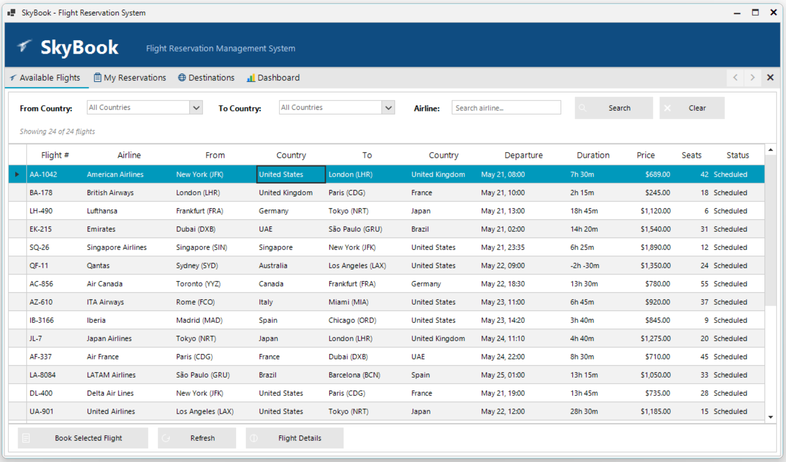

# Getting Started with the Telerik WinForms Converter

This article walks you through migrating an existing Microsoft WinForms application to Telerik UI for WinForms components using the [Telerik WinForms Converter](). By the end of this guide, your application—or parts of it, depending on its size—will be converted to use Telerik RadControls. This guide covers the full migration process — from opening your project to verifying the converted application.

## Step 0: Check the Prerequisites

Before you start, ensure you have the following [Converter prerequisites](#prerequisites) and [configure the MCP server]() on your side. The section below shows the Visual Studio-specific configuration:

### Configure MCP server in Visual Studio

1. Add `.mcp.json` to your solution folder. Choose the variant that matches your target .NET runtime:

<TabStrip>
<TabStripTab title=".NET 10 (using 'dnx' command)">

```json
{
  "servers": {
    "telerik-winforms-assistant": {
      "type": "stdio",
      "command": "dnx",
      "args": [ "Telerik.WinForms.MCP", "--yes" ],
      "env": {
        "TELERIK_LICENSE_PATH": "THE_PATH_TO_YOUR_LICENSE_FILE"
      }
    }
  }
}
```

</TabStripTab>
<TabStripTab title=".NET 8 / .NET 9 (using 'dotnet tool' command)">

```json
{
  "servers": {
    "telerik-winforms-assistant": {
      "type": "stdio",
      "command": ".\\.tools\\telerik-winforms-assistant.exe",
      "env": {
        "TELERIK_LICENSE_PATH": "THE_PATH_TO_YOUR_LICENSE_FILE"
      }
    }
  }
}
```

</TabStripTab>
</TabStrip>


2. Restart Visual Studio.
3. Enable the `telerik-winforms-assistant` MCP server and all its tools in the [Copilot Chat window's tool selection dropdown](https://learn.microsoft.com/en-us/visualstudio/ide/mcp-servers?view=vs-2022#configuration-example-with-github-mcp-server).



> In the `telerik-winforms-assistant` dropdown you can see all [Telerik MCP tools used to convert your project](). Please ensure that `telerik-winforms-assistant` and its tools are enabled before starting conversion.

## Step 1: Open Your Project

Open your WinForms solution in an MCP-compatible IDE. Verify that the `telerik-winforms-assistant` MCP server is active. In VS Code, check the MCP server status in the Copilot Chat panel. In Visual Studio, look for the "Running telerik-winforms-assistant" message in the Output pane.

## Step 2: Start the Migration

Open the AI chat in 'Agent' mode and use one of the pre-built prompts from the MCP prompt list, or enter one of the following prompts:

**Migrate the entire project:**

```
Migrate WinForms Project to Telerik

```

**Migrate with a dry run (preview changes before applying):**

```
Migrate WinForms Project to Telerik (Dry Run)

```

Here are the pre-built prompts from the MCP prompt list:

| Prompt | Description |
|---|---|
| **Migrate WinForms Project to Telerik** | Full project migration with automatic backup of each file. |
| **Migrate WinForms Project to Telerik (Dry Run)** | Preview all changes before they are written to disk. |
| **Convert Single File to Telerik** | Convert one file (and its Designer counterpart if applicable). |

## Step 3: Review the Migration Plan

The AI agent first calls `telerik_get_migration_plan` to retrieve the recommended workflow. It then calls `telerik_analyze_project` to inspect your `.csproj` file. You may see output similar to:

* Project name and target framework (for example, `net8.0-windows` or `v4.8`).
* Project style (`SDK` or `Classic`).
* Whether the `Telerik.UI.for.WinForms.AllControls` NuGet package is already installed.

>tip If the AI agent cannot locate the `.csproj` file, it will prompt you to provide the correct path. Confirm the path in the dialog that appears.

When running different tools, 'telerik-winforms-assistant' may ask you for permission. You can choose whether to confirm each task individually or confirm all at once.



## Step 4: Add Telerik NuGet References

The AI agent calls `telerik_add_package_reference` to add the `Telerik.UI.for.WinForms.AllControls` NuGet package to your project. For SDK-style projects, this adds a `<PackageReference>` element. For Classic-style projects, the tool modifies the `.csproj` directly.

After the package is added, the agent runs `dotnet restore` to download the Telerik assemblies from the Telerik NuGet server.

>note Ensure your NuGet configuration includes the Telerik NuGet source (`https://nuget.telerik.com/v3/index.json`) with valid credentials. Refer to the [Telerik NuGet server setup](https://docs.telerik.com/devtools/winforms/installation-and-upgrades/download-product-files#telerik-nuget-server) for configuration details.

## Step 5: Convert Files

The AI agent converts your forms one at a time using the **Divide and Conquer** strategy:

1. Converts `FormName.Designer.cs` (control declarations and layout).
2. Converts `FormName.cs` (event handlers and logic).
3. Builds the project and fixes any compilation errors in the converted pair.
4. Moves to the next form.

For each file, the `telerik_convert_file` tool:

* Replaces Microsoft control types with Telerik equivalents (for example, `Button` → `RadButton`).
* Maps properties and enum values to their Telerik counterparts.
* Adds required `using Telerik.WinControls.UI;` directives.
* Comments out properties that have no Telerik equivalent and flags them for review.
* Creates a `.bak` backup of the original file.

>tip If the agent reports items in the `itemsToReview` array, it will automatically query the `telerik_winforms_assistant` tool to find Telerik alternatives for removed properties.

## Step 6: Apply a Theme

After all forms are converted, the AI agent calls `telerik_get_theme_setup` and applies the Fluent theme. The preferred method uses `App.config`:

```xml
<?xml version="1.0" encoding="utf-8"?>
<configuration>
  <appSettings>
    <add key="TelerikWinFormsThemeName" value="Fluent" />
  </appSettings>
</configuration>
```

## Step 7: Verify the Migration

The AI agent runs a final build to confirm the migration is complete. At this point:

1. Run the application and verify the UI renders correctly.
1. Test key user workflows to confirm functionality is preserved.
1. Review the `.bak` files if you need to compare original and converted code.

>tip Use source control (Git) to review the full diff of changes. The converter creates `.bak` files as an additional safety net, but source control provides the most reliable comparison.

## Step 8: Final Results

At the end, you will have the WinForms app converted to use Telerik UI for WinForms components. A short summary is displayed along with recent changes and updated files so you can preview them:


Below you can see the result after conversion completes:

#### Before conversion (Microsoft WinForms):



#### After conversion (Telerik UI for WinForms):



## Troubleshooting

The following table lists common issues during migration:

| Issue | Cause | Resolution |
|---|---|---|
| Build errors after conversion | Properties removed because they have no Telerik equivalent. | Review the `itemsToReview` output. The agent suggests alternatives or you can remove the lines manually. |
| NuGet restore fails | Telerik NuGet source not configured or credentials expired. | Verify the Telerik NuGet feed is added and your credentials are current. |
| MCP server not responding | Server not started or license not configured. | Restart the IDE and verify `TELERIK_LICENSE_PATH` is set in `.mcp.json`. |
| Path elicitation prompt appears | The agent cannot locate the `.csproj` or a source file. | Provide the correct absolute path when prompted. |
| Trial limit reached (20 files) | Trial accounts have a 20-file conversion limit. | Upgrade to a Subscription license for unlimited conversions. |

## See Also

* [Telerik WinForms Converter Overview]()
* [Converter MCP Tools, Prompts, and Engine Reference]()
* [Configure the Telerik WinForms MCP Server]()
