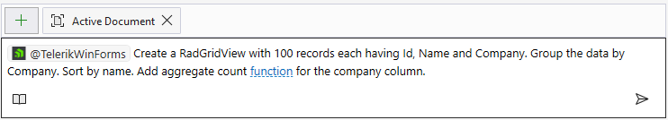

# Telerik WinForms GitHub Copilot Extension

The Telerik WinForms [GitHub Copilot](https://github.com/features/copilot) extension is an AI-powered coding assistant that provides specialized knowledge about [Telerik UI for WinForms components](https://www.telerik.com/products/winforms.aspx). 

>caution [Microsoft is sunsetting GitHub Copilot extensions](https://github.blog/changelog/2025-09-24-deprecate-github-copilot-extensions-github-apps/) on November 10th, 2025, in favor of the Model Context Protocol (MCP) standard. 
> 
> From that date, the Telerik and Kendo UI AI Coding Assistants will be available exclusively through our [MCP server](), ensuring you continue to enjoy the same powerful capabilities that are delivered by a modern, open, and officially recommended standard.

>tip The Telerik .NET MAUI MCP Server works in **Chat**(**Ask**) and **Agent** modes.

This extension enhances GitHub Copilot with proprietary context about Telerik WinForms controls, helping you:

* Generate code snippets using Telerik WinForms components.
* Get contextual suggestions for component properties and methods.
* Access best practices and implementation patterns.
* Speed up development with AI-powered code completion.

## Prerequisites

Before using the Telerik WinForms GitHub Copilot extension, ensure you have:

* An active [GitHub Copilot](https://github.com/features/copilot) subscription. You can enable or configure GitHub Copilot on the [Copilot Settings page in your GitHub account](https://github.com/settings/copilot).
* A [Telerik user account](https://www.telerik.com/account/?_gl=1*rbcezh*_gcl_au*NzA0NDU3NzU1LjE3NTA2NTk3NDY.*_ga*ODUxNTg5NDI5LjE2OTU2NDQ2ODI.*_ga_9JSNBCSF54*czE3NTQ1NDQ5MTQkbzE0NSRnMSR0MTc1NDU3MjMxMiRqMzAkbDAkaDA.).
* An active [DevCraft or Telerik UI for WinForms license](https://www.telerik.com/purchase/individual/winforms.aspx) or a [Telerik UI for WinForms trial](https://www.telerik.com/try/ui-for-winforms).
* A [WinForms application that includes Telerik UI for WinForms](https://docs.telerik.com/devtools/winforms/getting-started/first-steps).
* The latest version of your [Copilot-enabled app](https://docs.github.com/en/copilot/building-copilot-extensions/about-building-copilot-extensions#supported-clients-and-ides) (for example, Visual Studio or Visual Studio Code).

## Installation

Follow these steps to install and configure the Telerik WinForms Copilot extension:

1. Go to the [Telerik WinForms GitHub App](https://github.com/apps/telerikwinforms) page and click the **Install** button.
1. You will see a list that includes your GitHub account and all GitHub organizations that you are part of. Select your GitHub account.
1. Click the **Install & Allow** button. This will allow the GitHub Copilot extension to integrate with your GitHub account.
1. Enter your GitHub password when prompted.
1. You will be redirected to telerik.com. Enter your Telerik account credentials if prompted. This step links the GitHub Copilot extension with your Telerik account.
1. Upon successful Telerik authentication, you will be redirected to a confirmation page that indicates successful Copilot extension installation.
1. Restart your [Copilot-enabled app](https://docs.github.com/en/copilot/building-copilot-extensions/about-building-copilot-extensions#supported-clients-and-ides) (for example, Visual Studio and Visual Studio Code).
1. Start a new chat session in Copilot.

## Usage

To use the Telerik WinForms Copilot extension:

1. Open the GitHub Copilot chat window in your [Copilot-enabled app](https://docs.github.com/en/copilot/building-copilot-extensions/about-building-copilot-extensions#supported-clients-and-ides) (for example, Visual Studio or VS Code).
1. Ensure you are in **Chat** mode and not in **Edit** or **Agent** mode. The Edit and Agent modes do not use the Telerik Copilot extension. However, the Agent mode can use the [Telerik WinForms MCP server]().
1. Start your prompt with `@telerikwinforms` and type your request. Verify that `@telerikwinforms` is recognized and highlighted; otherwise, the extension may not be properly installed.
1. Look for a status label such as **Telerik WinForms working...** or **Telerik WinForms generating response...** in the output to confirm the extension is active.
1. Grant permission to the Telerik WinForms extension to read your workspace files when prompted.
1. For unrelated queries, start a new chat session in a new window to avoid context pollution from previous conversations.
1. Use in **Chat**(**Ask**) and **Agent** modes.
   
### Sample Prompts

The following examples demonstrate useful prompts for the Telerik WinForms extension:

* "`@telerikwinforms` Create a RadGridView with 100 records each having Id, Name and Company. Group the data by Company. Sort by name. Add aggregate count function for the company column."
* "`@telerikwinforms` Create a RadGridView with 100 employee records with two columns for name and company name. Include paging in the RadGridView with 20 records per page."
* "`@telerikwinforms` Create a line RadChartView with 100 records of sample data. Each record should have Value plotted on the vertical axis and Date on the horizontal axis."
* "`@telerikwinforms` Show me how to size all columns in GridView to take all the available space."

>tip Visit the Telerik UI for WinForms Prompt Library for more sample prompts.

## Number of Requests

A Telerik [Subscription license](https://www.telerik.com/purchase/faq/licensing-purchasing) is recommended in order to use the Telerik WinForms AI Coding Assistant without restrictions. Perpetual license holders and trial users can make a limited [number of requests per year](#number-of-requests).

## Troubleshooting

If you encounter issues:

* Ensure the `@telerikwinforms` mention is properly highlighted in your prompt.
* Verify that you have an active GitHub Copilot subscription.
* Restart your IDE after installation.
* Check that you're in Chat mode, not Edit or Agent mode.

## See Also 

* [GitHub Copilot Documentation](https://docs.github.com/en/copilot)
* [GitHub Copilot Tutorials](https://github.com/features/copilot/tutorials)
* [Telerik WinForms MCP Server]()
* [Telerik UI for WinForms Documentation](https://docs.telerik.com/devtools/winforms/introduction)
