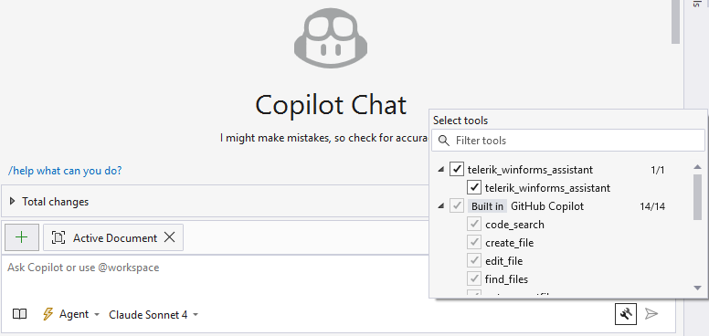
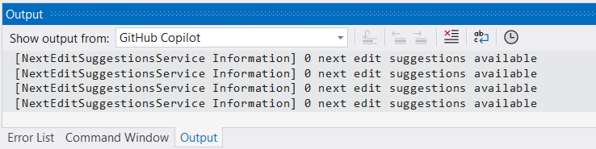

# Telerik UI for WinForms AI Tools Overview

The Telerik UI for WinForms AI Tools are delivered through a single Model Context Protocol (MCP) server that connects your AI client to UI-generation capabilities and knowledge specific to Telerik UI for WinForms. From idea to implementation, you can use the MCP server to generate forms, configure components correctly, and reduce repetitive setup work.

# Getting Started with the Telerik MCP Server

The Telerik WinForms [MCP (Model Context Protocol) Server](https://modelcontextprotocol.io/introduction) enhances your AI-powered development experience by providing specialized context about Telerik UI for WinForms components.

This MCP server enables AI-powered IDEs and tools to generate more accurate, tailored code that leverages [Telerik UI for WinForms components](https://docs.telerik.com/devtools/winforms/introduction) and APIs. You can ask complex questions about Telerik components, request specific implementations, and generate comprehensive code solutions.

>tip The Telerik WinForms MCP Server works in **Chat**(**Ask**) and **Agent** modes.

## What Are the Telerik UI for WinForms AI Tools

The Telerik WinForms MCP Server is a local MCP server that is distributed through the [Telerik.WinForms.MCP](https://www.nuget.org/packages/Telerik.WinForms.MCP) NuGet package. It offers two tools:

| Tool | Description |
|---|---|
| **[Telerik AI Coding Assistant]()** | An AI-powered code generation tool that provides specialized context to AI models, enabling them to produce higher-quality code samples using Telerik UI for WinForms components and APIs. |
| **[Telerik Converter]()** | An automated migration tool that converts existing Microsoft WinForms applications to use Telerik UI for WinForms controls. |

### Telerik AI Coding Assistant

The Telerik UI for WinForms AI Coding Assistant provides specialized context to AI models, enabling them to produce higher-quality code samples using [Telerik UI for WinForms components](https://www.telerik.com/products/winforms.aspx) and APIs. Use it to generate forms, configure components, and reduce repetitive setup work.

### Telerik Converter

The [Telerik UI for WinForms Converter]() automatically migrates existing Microsoft WinForms applications to use Telerik RadControls. It uses Microsoft Roslyn to parse and transform C# and VB.NET source code with full context awareness — mapping control types, properties, events, and enum values to their Telerik equivalents.

## Prerequisites

To use the **Telerik WinForms MCP Server** you need:

* A [Telerik user account](https://www.telerik.com/account/).
* An active [DevCraft or Telerik UI for WinForms license](https://www.telerik.com/purchase/individual/winforms.aspx) or a [Telerik UI for WinForms trial](https://www.telerik.com/try/ui-for-winforms).
* A Telerik [Subscription license](https://www.telerik.com/purchase/faq/licensing-purchasing) for full access. Perpetual license holders do not have access by default—see [License Requirements](#license-requirements) for details.
* An [MCP-compatible client](https://modelcontextprotocol.io/clients) that supports MCP tools (latest version recommended).
* A WinForms application targeting modern .NET or classic .NET Framework.
* A valid [Telerik license key]().

### Supported .NET Runtimes

| Target Runtime | Required SDK | Invocation Method | Notes |
|----------------|--------------|-------------------|-------|
| **.NET 10 (Recommended)** | .NET 10 SDK (Preview 6 or newer) | `dnx` dynamic execution | Simplest approach; no prior install step |
| .NET 8 / .NET 9 | .NET 8 or .NET 9 SDK | Local dotnet tool (`telerik-winforms-assistant.exe`) | `dnx` not supported; install tool manually |

## License Requirements

Access to the Telerik MCP Server depends on your [Telerik license type](https://www.telerik.com/purchase/faq/licensing-purchasing):

| License Type | AI Coding Assistant | Details |
|---|---|---|
| **Subscription License** | Yes | A Subscription is the primary license that grants full access to the AI Coding Assistant. It includes a virtually unlimited number of requests, with a fair use threshold of 300 requests per day. Best for ongoing and high-volume usage. |
| **Trial License** | Yes | Trial access is designed for evaluating the feature before purchasing. Reactivating the same trial for a new release does not grant additional requests. |
| **Perpetual License** | No* | Perpetual license holders have no access to the AI Coding Assistant. Start a [30-day trial](https://www.telerik.com/try/ui-for-winforms) or convert Perpetual license to a Subscription license. |

<small>*\* Perpetual license holders can access the AI Coding Assistant through a [30-day AI Tools trial](https://www.telerik.com/try/ui-for-winforms) or a [Telerik UI for WinForms trial](https://www.telerik.com/try/ui-for-winforms). After the trial expires, access is no longer available unless the Perpetual license is converted to a Subscription license.*</small>

>tip All Telerik AI tools share a single request limit for your Telerik account. Requests made through the Telerik MCP server count against the same usage quota. When using the Telerik MCP server, one prompt may trigger several requests, depending on the prompt complexity.

## MCP Installation

The Telerik WinForms [MCP (Model Context Protocol) Server](https://modelcontextprotocol.io/introduction) is available as a NuGet package. Beginning with **.NET 10** it can be executed directly via the `dnx` command. For .NET 8 and .NET 9 (where `dnx` is not available) you can install it as a local dotnet tool and invoke its executable.

## Summary of Installation Approaches

| Aspect | .NET 8 / 9 | **.NET 10 (Recommended)** |
|--------|------------|---------|
| Availability of `dnx` | Not available | Available |
| Install Command | `dotnet tool install --tool-path ./.tools Telerik.WinForms.MCP` | None (resolved on demand) |
| Executable Path | `./.tools/telerik-winforms-assistant.exe` | Handled by `dnx` |
| .mcp.json Command | `.\\.tools\\telerik-winforms-assistant.exe` | `dnx` |
| .mcp.json Args | _None_ | `Telerik.WinForms.MCP`, `--yes` |
| Update Version | Re-run tool install with `--version` or `tool update` | Handled by latest package resolved by `dnx` |
| Offline Use | Requires prior tool install | Requires prior NuGet cache warm-up |

### Server Installation

#### .NET 10 (Recommended)

No manual install step is needed. The `dnx` command will download and execute the NuGet package on demand.

#### .NET 8 / .NET 9

Install the MCP server as a local tool in your solution root (or another chosen path):

```powershell
dotnet tool install --tool-path ./.tools Telerik.WinForms.MCP
```

If updating:

```powershell
dotnet tool update --tool-path ./.tools Telerik.WinForms.MCP
```

This creates the executable at `./.tools/telerik-winforms-assistant.exe`.

### Server Configuration

#### .NET 10 Configuration (`.mcp.json`)

Use these settings when configuring the server in your MCP client:

| Setting | Value |
|---------|-------|
| Package Name | `Telerik.WinForms.MCP` |
| Type | `stdio` |
| Command | `dnx` |
| Arguments | `Telerik.WinForms.MCP`, `--yes` |
| Server Name | `telerik-winforms-assistant` (customizable) |


#### .NET 8 / .NET 9 Configuration (`.mcp.json`)

Add a `.mcp.json` file to your solution root (or to `%USERPROFILE%` for global usage):

```json
{
  "servers": {
    "telerik-winforms-assistant": {
      "type": "stdio",
      "command": ".\\.tools\\telerik-winforms-assistant.exe",
      "env": {
        "TELERIK_LICENSE_PATH": "THE_PATH_TO_YOUR_LICENSE_FILE"
      }
    }
  }
}
```

If you prefer embedding the license string directly:

```json
"env": {
  "TELERIK_LICENSE": "YOUR_LICENSE_KEY"
}
```

### Workspace-Specific Setup

Add a `.mcp.json` file to your solution (root) folder. Choose the variant that matches your target .NET runtime:

#### .NET 10 Example (using `dnx`)
```json
{
  "servers": {
    "telerik-winforms-assistant": {
      "type": "stdio",
      "command": "dnx",
      "args": ["Telerik.WinForms.MCP", "--yes"],
      "env": {
        "TELERIK_LICENSE_PATH": "THE_PATH_TO_YOUR_LICENSE_FILE"
      }
    }
  }
}

```

#### .NET 8 / .NET 9 Example
```json
{
  "servers": {
    "telerik-winforms-assistant": {
      "type": "stdio",
      "command": ".\\.tools\\telerik-winforms-assistant.exe",
      "env": {
        "TELERIK_LICENSE_PATH": "THE_PATH_TO_YOUR_LICENSE_FILE"
      }
    }
  }
}
```

You may substitute `TELERIK_LICENSE` instead of `TELERIK_LICENSE_PATH` (see License Configuration section below for details and recommendations). The `inputs` array is optional and not required for current functionality.

After saving the file, restart Visual Studio and enable the `telerik-winforms-assistant` tool in the [Copilot Chat window's tool selection dropdown](https://learn.microsoft.com/en-us/visualstudio/ide/mcp-servers?view=vs-2022#configuration-example-with-github-mcp-server).


### Global Setup

To enable the server globally for all projects, add the `.mcp.json` file to your user directory (`%USERPROFILE%`, e.g., `C:\Users\YourName\.mcp.json`). The same distinction applies: use the executable path for .NET 8/9, or `dnx` for .NET 10.


## License Configuration

Add your [Telerik license key]() as an environment parameter in your `mcp.json` file using one of these options:

**Option 1: License File Path (Recommended)**

 ```json
 "env": {
     "TELERIK_LICENSE_PATH": "THE_PATH_TO_YOUR_LICENSE_FILE"
 }
 ```

The THE_PATH_TO_YOUR_LICENSE_FILE should point to the telerik-license.txt file, which is usually located in the AppData folder. So, the field often will look like this: "TELERIK_LICENSE_PATH": "%appdata%/Telerik/telerik-license.txt"

**Option 2: Direct License Key**

 ```json
 "env": {
     "TELERIK_LICENSE": "YOUR_LICENSE_KEY_HERE"
 }
 ```

> Option 1 is recommended unless you're sharing settings across different systems. Remember to [update your license key](#updating-your-license-key) when necessary.

## Visual Studio

For complete setup instructions, see [Use MCP servers in Visual Studio](https://learn.microsoft.com/en-us/visualstudio/ide/mcp-servers).

> Early Visual Studio 17.14 versions require the Copilot Chat window to be open when opening a solution for the MCP server to work properly.

### Workspace-Specific Setup:

1. Add `.mcp.json` to your solution folder:

 ```json
 {
   "inputs": [],
   "servers": {
     "telerik-winforms-assistant": {
       "type": "stdio",
       "command": "npx",
       "args": ["-y", "@progress/telerik-winforms-mcp@latest"],
       "env": {
         "TELERIK_LICENSE_PATH": "THE_PATH_TO_YOUR_LICENSE_FILE",
         // or
         "TELERIK_LICENSE": "YOUR_LICENSE_KEY"
       }
     }
   }
 }
 ```

2. Restart Visual Studio.
3. Enable the `telerik-winforms-assistant` tool in the [Copilot Chat window's tool selection dropdown](https://learn.microsoft.com/en-us/visualstudio/ide/mcp-servers?view=vs-2022#configuration-example-with-github-mcp-server).



### Global Setup:

Add the `.mcp.json` file to your user directory (`%USERPROFILE%`, e.g., `C:\Users\YourName\.mcp.json`).

## Usage

To use the Telerik MCP Server:

1. Start your prompt with one of these triggers:
   - `/telerik` / `@telerik` / `#telerik`
   - `/telerikwinforms` / `@telerikwinforms` / `#telerikwinforms`
   - `#telerik-winforms-assistant`

2. Verify server activation by looking for these messages:
   - Visual Studio: `Running telerik-winforms-assistant`
   - Visual Studio Code: `Running telerik-winforms-assistant`
   - Cursor: `Calling MCP tool telerik-winforms-assistant`

3. Grant permissions when prompted (per session, workspace, or always).

4. Start fresh sessions for unrelated prompts to avoid context pollution.

5. Use in **Chat**(**Ask**) and **Agent** modes.

You can check the Output pane of Visual Studio for diagnostics information related to Copilot. To display the relevant information, select to show output from GitHub Copilot.



### Improving Server Usage

To increase the likelihood of the Telerik MCP server being used, add custom instructions to your AI tool:
- [GitHub Copilot custom instructions](https://docs.github.com/en/copilot/customizing-copilot/adding-repository-custom-instructions-for-github-copilot#about-repository-custom-instructions-for-github-copilot-chat)
- [Cursor rules](https://docs.cursor.com/context/rules)

### Sample Prompts

The following examples demonstrate useful prompts for the Telerik WinForms MCP Server:

* "`/telerik` Generate a RadGridView with sorting and paging. Bind it to a Person model with a sample ViewModel."
* "`/telerikwinforms` Create a RadDropDownList showing a product list of 20 items. Include Product class and sample data."
* "`/telerik` Build a RadListView with sorting and filtering capabilities."

## Number of Requests

A Telerik [Subscription license](https://www.telerik.com/purchase/faq/licensing-purchasing) is recommended in order to use the Telerik WinForms AI Coding Assistant without restrictions. Perpetual license holders and trial users can make a limited [number of requests per year](#number-of-requests).

## Local AI Model Integration

You can use the Telerik WinForms MCP server with local large language models (LLMs):

1. Run a local model, for example, through [Ollama](https://ollama.com).
2. Use a bridge package like [MCP-LLM Bridge](https://github.com/patruff/ollama-mcp-bridge).
3. Connect your local model to the Telerik MCP server.

This setup allows you to use the Telerik AI Coding Assistant without cloud-based AI models.

## See Also

* [AI Coding Assistant Overview]()
