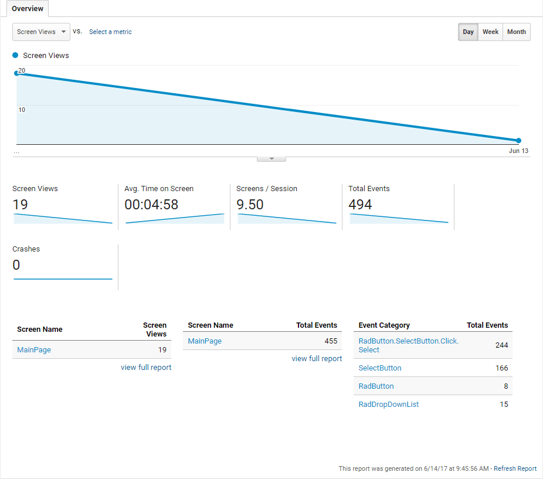

# Google Analytics Integration

If you wish to analyze the usage data of the application using **Google Analytics**, you can check the [Windows SDK for Google Analytics GitHub repository](https://github.com/dotnet/windows-sdk-for-google-analytics) and build the project located in **GoogleAnalytics.Core**. You then need to add a reference to the generated assembly (**GoogleAnalytics.Core.dll**) to your custom project.

>important the GoogleAnalytics.Core.dll has a dependancy against .NET Framework 4.5.1 which should be tarteted in the client`s application.

This article demonstrates a simple implementation according to the API provided by the Windows SDK for Google Analytics.

#### IPlatformInfoProvider Implementation

{{source=..\SamplesCS\Analytics\AnalyticsForm.cs region=IPlatformInfoProviderImplementation}} 
{{source=..\SamplesVB\Analytics\AnalyticsForm.vb region=IPlatformInfoProviderImplementation}}
````C#
internal class PlatformInfoProvider : IPlatformInfoProvider
{
    public string AnonymousClientId { get; set; }
    public int? ScreenColors { get; set; }
    public Dimensions ScreenResolution { get; set; }
    public string UserAgent { get; set; }
    public string UserLanguage { get; set; }
    public Dimensions ViewPortResolution { get; set; }
    Dimensions? IPlatformInfoProvider.ScreenResolution { get; }
    Dimensions? IPlatformInfoProvider.ViewPortResolution { get; }
    public event EventHandler ScreenResolutionChanged;
    public event EventHandler ViewPortResolutionChanged;
    public void OnTracking()
    {
        throw new NotImplementedException();
    }
}

````
````VB.NET
Friend Class PlatformInfoProvider
    Implements IPlatformInfoProvider
    Public Property AnonymousClientId() As String Implements IPlatformInfoProvider.AnonymousClientId
        Get
            Return m_AnonymousClientId
        End Get
        Set
            m_AnonymousClientId = Value
        End Set
    End Property
    Private m_AnonymousClientId As String
    Public Property ScreenColors() As System.Nullable(Of Integer) Implements IPlatformInfoProvider.ScreenColors
        Get
            Return m_ScreenColors
        End Get
        Set
            m_ScreenColors = Value
        End Set
    End Property
    Private m_ScreenColors As System.Nullable(Of Integer)
    Public Property ScreenResolution() As Dimensions
        Get
            Return m_ScreenResolution
        End Get
        Set
            m_ScreenResolution = Value
        End Set
    End Property
    Private m_ScreenResolution As Dimensions
    Public Property UserAgent() As String Implements IPlatformInfoProvider.UserAgent
        Get
            Return m_UserAgent
        End Get
        Set
            m_UserAgent = Value
        End Set
    End Property
    Private m_UserAgent As String
    Public Property UserLanguage() As String Implements IPlatformInfoProvider.UserLanguage
        Get
            Return m_UserLanguage
        End Get
        Set
            m_UserLanguage = Value
        End Set
    End Property
    Private m_UserLanguage As String
    Public Property ViewPortResolution() As Dimensions
        Get
            Return m_ViewPortResolution
        End Get
        Set
            m_ViewPortResolution = Value
        End Set
    End Property
    Private m_ViewPortResolution As Dimensions
    Private ReadOnly Property IPlatformInfoProvider_ScreenResolution() As System.Nullable(Of Dimensions) Implements IPlatformInfoProvider.ScreenResolution
    Private ReadOnly Property IPlatformInfoProvider_ViewPortResolution() As System.Nullable(Of Dimensions) Implements IPlatformInfoProvider.ViewPortResolution
    Public Event ScreenResolutionChanged As EventHandler Implements IPlatformInfoProvider.ScreenResolutionChanged
    Public Event ViewPortResolutionChanged As EventHandler Implements IPlatformInfoProvider.ViewPortResolutionChanged
    Public Sub OnTracking() Implements IPlatformInfoProvider.OnTracking
        Throw New NotImplementedException()
    End Sub
End Class

```` 


{{endregion}}

You can then use this provider in your custom implementation of the **ITraceMonitor** interface. Please note that you have to pass your own **Google Analytics tracking ID** in the **CreateTracker** method of the **TrackerManager**.

#### Custom ITraceMonitor Implementation

{{source=..\SamplesCS\Analytics\AnalyticsForm.cs region=CustomITraceMonitorImplementation}} 
{{source=..\SamplesVB\Analytics\AnalyticsForm.vb region=CustomITraceMonitorImplementation}}
````C#
public class CustomAnalitycsMonitor : ITraceMonitor
{
    private Tracker tracker;
    public CustomAnalitycsMonitor()
    {
        this.CreateGoogleTracker();
    }
    public void CreateGoogleTracker()
    {
        var trackerManager = new TrackerManager(new PlatformInfoProvider()
        {
            AnonymousClientId = "b597d28a-0d6c-42ed-9dcb-f89e98006b37", // Random UUID
            ScreenResolution = new Dimensions(1920, 1080),
            UserAgent = "Mozilla/5.0 (Windows NT 6.3; WOW64; Trident/7.0; rv:11.0) like Gecko",
            UserLanguage = "en-us",
            ViewPortResolution = new Dimensions(1920, 1080)
        });
        tracker = trackerManager.CreateTracker("YOUR_PROPERTY_ID"); // your GoogleAnalytics property ID goes here
        tracker.AppName = "Winforms App";
    }
    public void TrackAtomicFeature(string feature)
    {
        // The value of the "feature" string consists of the whole name of the tracked feature,
        // for example : "MyGridView.Sorted.Name.Ascending", if we have performed a sorting operation in RadGridView.
        // So, we can split this string in order to pass friendlier names to the parameters of the CreateCustomEvent method which will be used in your reports.
        string category;
        string eventAction;
        this.SplitFeatureName(feature, out category, out eventAction);
        var data = HitBuilder.CreateCustomEvent(category, eventAction + " event", feature.ToString(), 1).Build();
        tracker.Send(data);
    }
    public void TrackError(string feature, Exception exception)
    {
        var data = HitBuilder.CreateException(feature + ":" + exception.ToString(), true).Build();
        tracker.Send(data);
    }
    public void TrackFeatureCancel(string feature)
    {
        string category;
        string eventAction;
        this.SplitFeatureName(feature, out category, out eventAction);
        var data = HitBuilder.CreateCustomEvent(category, eventAction + " event.Cancelled", feature.ToString(), 1).Build();
        tracker.Send(data);
    }
    public void TrackFeatureStart(string feature)
    {
        // Measuring timings provides a native way to measure a period of time in Google Analytics. 
        // This can be useful to measure resource load times, for example.
        TimeSpan ts = TimeSpan.FromSeconds(2.2);
        var loadTiming = HitBuilder.CreateTiming("Loaded", "MainWindow", ts).Build();
        tracker.Send(loadTiming);
    }
    public void TrackFeatureEnd(string feature)
    {
        TimeSpan ts = TimeSpan.FromSeconds(2.2);
        var unLoadTiming = HitBuilder.CreateTiming("Loaded", "MainWindow", ts).Build();
        tracker.Send(unLoadTiming);
    }
    public void TrackValue(string feature, long value)
    {
        string category;
        string eventAction;
        this.SplitFeatureName(feature, out category, out eventAction);
        var data = HitBuilder.CreateCustomEvent(category, eventAction + " event", feature.ToString(), value).Build();
        tracker.Send(data);
    }
    private void SplitFeatureName(string feature, out string category, out string eventAction)
    {
        string[] parameters = feature.Split('.');
        category = parameters[0];
        eventAction = parameters[1];
    }
}

````
````VB.NET
Public Class CustomAnalitycsMonitor
    Implements ITraceMonitor
    Private tracker As Tracker
    Public Sub New()
        Me.CreateGoogleTracker()
    End Sub
    Public Sub CreateGoogleTracker()
        ' Random UUID
        Dim trackerManager = New TrackerManager(New PlatformInfoProvider() With {
            .AnonymousClientId = "b597d28a-0d6c-42ed-9dcb-f89e98006b37",
            .ScreenResolution = New Dimensions(1920, 1080),
            .UserAgent = "Mozilla/5.0 (Windows NT 6.3; WOW64; Trident/7.0; rv:11.0) like Gecko",
            .UserLanguage = "en-us",
            .ViewPortResolution = New Dimensions(1920, 1080)
        })
        tracker = trackerManager.CreateTracker("YOUR_PROPERTY_ID")
        ' your GoogleAnalytics property ID goes here
        tracker.AppName = "Winforms App"
    End Sub
    Public Sub TrackAtomicFeature(feature As String) Implements ITraceMonitor.TrackAtomicFeature
        ' The value of the "feature" string consists of the whole name of the tracked feature,
        ' for example : "MyGridView.Sorted.Name.Ascending", if we have performed a sorting operation in RadGridView.
        ' So, we can split this string in order to pass friendlier names to the parameters of the CreateCustomEvent method which will be used in your reports.
        Dim category As String
        Dim eventAction As String
        Me.SplitFeatureName(feature, category, eventAction)
        Dim data = HitBuilder.CreateCustomEvent(category, eventAction & Convert.ToString(" event"), feature.ToString(), 1).Build()
        tracker.Send(data)
    End Sub
    Public Sub TrackError(feature As String, exception As Exception) Implements ITraceMonitor.TrackError
        Dim data = HitBuilder.CreateException((feature & Convert.ToString(":")) + exception.ToString(), True).Build()
        tracker.Send(data)
    End Sub
    Public Sub TrackFeatureCancel(feature As String) Implements ITraceMonitor.TrackFeatureCancel
        Dim category As String
        Dim eventAction As String
        Me.SplitFeatureName(feature, category, eventAction)
        Dim data = HitBuilder.CreateCustomEvent(category, eventAction & Convert.ToString(" event.Cancelled"), feature.ToString(), 1).Build()
        tracker.Send(data)
    End Sub
    Public Sub TrackFeatureStart(feature As String) Implements ITraceMonitor.TrackFeatureStart
        ' Measuring timings provides a native way to measure a period of time in Google Analytics. 
        ' This can be useful to measure resource load times, for example.
        Dim ts As TimeSpan = TimeSpan.FromSeconds(2.2)
        Dim loadTiming = HitBuilder.CreateTiming("Loaded", "MainWindow", ts).Build()
        tracker.Send(loadTiming)
    End Sub
    Public Sub TrackFeatureEnd(feature As String) Implements ITraceMonitor.TrackFeatureEnd
        Dim ts As TimeSpan = TimeSpan.FromSeconds(2.2)
        Dim unLoadTiming = HitBuilder.CreateTiming("Loaded", "MainWindow", ts).Build()
        tracker.Send(unLoadTiming)
    End Sub
    Public Sub TrackValue(feature As String, value As Long) Implements ITraceMonitor.TrackValue
        Dim category As String
        Dim eventAction As String
        Me.SplitFeatureName(feature, category, eventAction)
        Dim data = HitBuilder.CreateCustomEvent(category, eventAction & Convert.ToString(" event"), feature.ToString(), value).Build()
        tracker.Send(data)
    End Sub
    Private Sub SplitFeatureName(feature As String, ByRef category As String, ByRef eventAction As String)
        Dim parameters As String() = feature.Split("."c)
        category = parameters(0)
        eventAction = parameters(1)
    End Sub
End Class

```` 


{{endregion}}

All that is left is to set the static **ControlTraceMonitor.AnalyticsMonitor** property, possibly in the constructor of your application.

#### Set AnalyticsMonitor

{{source=..\SamplesCS\Analytics\AnalyticsForm.cs region=ITraceMonitorInstance}} 
{{source=..\SamplesVB\Analytics\AnalyticsForm.vb region=ITraceMonitorInstance}}
````C#
ControlTraceMonitor.AnalyticsMonitor = new CustomAnalitycsMonitor();

````
````VB.NET
ControlTraceMonitor.AnalyticsMonitor = New CustomAnalitycsMonitor()

```` 


{{endregion}}

If you then go to the Google Analytics dashboard after some user interaction has took place, you will find information and statistics for the registered features similar to the ones shown below.

>caption Figure 1: Google Analytics Dashboard 


# See Also

* [Analytics Support]()