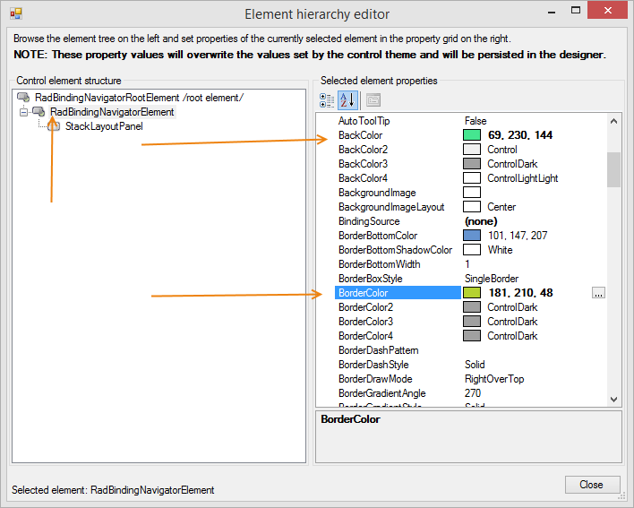

# Customizing RadBindingNavigator 

Each of the control's elements can be accessed and customized. Once you access the desired elements, you can tweak their properties in order to modify them. 

### Customize Fill and Border

You can access the control element by opening the [Element Hierarchy Editor]() from the controls smart tag. This allows you to select elements and change their properties. The next image shows how you can change the BackColor and the BorderColor.

>caption Figure 1: Change the BackColor and the BorderColor.



### Customize Buttons

The following snippet shows how you can access and change the properties of navigator buttons.

{{source=..\SamplesCS\DataEntryAndBindingNavigator\RadBindingNavigatorForm.cs region=changeButtonColor}} 
{{source=..\SamplesVB\DataEntryAndBindingNavigator\RadBindingNavigatorForm.vb region=changeButtonColor}}
````C#
radBindingNavigator1.BindingNavigatorElement.NextButton.BackColor = ColorTranslator.FromHtml("#e83737");
radBindingNavigator1.BindingNavigatorElement.NextButton.GradientStyle = Telerik.WinControls.GradientStyles.Solid;

````
````VB.NET
radBindingNavigator1.BindingNavigatorElement.NextButton.BackColor = ColorTranslator.FromHtml("#e83737")
radBindingNavigator1.BindingNavigatorElement.NextButton.GradientStyle = Telerik.WinControls.GradientStyles.Solid

````

{{endregion}} 

>caption The next button background is changed.


## See Also

 * [Properties]()

 * [Structure]()
