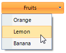

# Getting Started

* To add a __RadDropDownButton__ to your form, drag a __RadDropDownButton__ from the toolbox onto the surface of the form designer. Like a standard button, you can control the displayed text by setting the __Text__ property. Unlike a standard button, __RadDropDownButton__ displays drop-down items when clicked. So handling the __Click__ event of this button is not appropriate. Instead, work directly with the events for each item. To learn how to create and use items on a __RadDropDownButton__ see [Working with Telerik RadDropDownButton Items]().

* To programmatically add a __RadDropDownButton__ to a form, create a new instance of a __RadDropDownButton__, and add it to the form __Controls__ collection.

#### Adding a RadButton at runtime 

{{source=..\SamplesCS\Buttons\DropDownButton.cs region=CreatingButton}} 
{{source=..\SamplesVB\Buttons\DropDownButton.vb region=CreatingButton}} 

````C#
RadDropDownButton radDropDownButton = new RadDropDownButton();
radDropDownButton1.Text = "Fruits";
RadMenuItem item1 = new RadMenuItem("Orange");
radDropDownButton1.Items.Add(item1);
RadMenuItem item2 = new RadMenuItem("Lemon");
radDropDownButton1.Items.Add(item2);
RadMenuItem item3 = new RadMenuItem("Banana");
radDropDownButton1.Items.Add(item3);
this.Controls.Add(radDropDownButton);
````
````VB.NET
Dim radDropDownButton As New RadDropDownButton()
radDropDownButton1.Text = "Fruits"
Dim item1 As New RadMenuItem("Orange")
radDropDownButton1.Items.Add(item1)
Dim item2 As New RadMenuItem("Lemon")
radDropDownButton1.Items.Add(item2)
Dim item3 As New RadMenuItem("Banana")
radDropDownButton1.Items.Add(item3)
Me.Controls.Add(radDropDownButton)

````

{{endregion}} 




