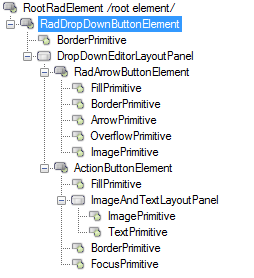

# Structure

>caption Fig.1 RadDropDownButton's elements hierarchy

1. __RadArrowButtonElement__: represents the arrow button that opens the popup
2. __ActionButtonElement__: represents the action button element
3. __RadMenuItem__: represents the drop down item
4. __RadDropDownButtonPopup__: represents the drop down

>caption Fig.2 RadDropDownButton's structure

