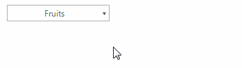

# Tooltips

There are two ways to assign tooltips to __RadDropDownButton__, namely setting the __ToolTipText__ property of the __DropDownButtonElement__, or as in most of the RadControls by using the __ToolTipTextNeeded__ event of __RadDropDownButton__. It is necessary the __ShowItemToolTips__ property to be set to *true* which is the default value.

#### Setting the ToolTipText property

{{source=..\SamplesCS\Buttons\DropDownButton.cs region=SetToolTipText}} 
{{source=..\SamplesVB\Buttons\DropDownButton.vb region=SetToolTipText}}

````C#
this.radDropDownButton1.DropDownButtonElement.ToolTipText = "Click me";

````
````VB.NET
Me.radDropDownButton1.DropDownButtonElement.ToolTipText = "Click me"

````

{{endregion}} 

>tip In order to assign different tooltips for the action part and the arrow button, you must specify the __ToolTipText__ property of the DropDownButtonElement.__ActionButton__ or DropDownButtonElement.__ArrowButton__ element.



#### Setting tool tips in the ToolTipTextNeeded event

{{source=..\SamplesCS\Buttons\DropDownButton.cs region=ToolTipTextNeeded}} 
{{source=..\SamplesVB\Buttons\DropDownButton.vb region=ToolTipTextNeeded}}

````C#
private void RadDropDownButton1_ToolTipTextNeeded(object sender, Telerik.WinControls.ToolTipTextNeededEventArgs e)
{
    ActionButtonElement actionButtonElement = sender as ActionButtonElement;
    RadArrowButtonElement arrowButtonElement = sender as RadArrowButtonElement;
    if (actionButtonElement!=null)
    {
        e.ToolTipText = "ActionButtonElement";
    }
    else if (arrowButtonElement!=null)
    {
        e.ToolTipText = "RadArrowButtonElement";
    }
}

````
````VB.NET
Private Sub RadDropDownButton1_ToolTipTextNeeded(sender As Object, e As Telerik.WinControls.ToolTipTextNeededEventArgs)
    Dim actionButtonElement As ActionButtonElement = TryCast(sender, ActionButtonElement)
    Dim arrowButtonElement As RadArrowButtonElement = TryCast(sender, RadArrowButtonElement)
    If actionButtonElement IsNot Nothing Then
        e.ToolTipText = "ActionButtonElement"
    ElseIf arrowButtonElement IsNot Nothing Then
        e.ToolTipText = "RadArrowButtonElement"
    End If
End Sub

````

{{endregion}} 


>tip The __ToolTipTextNeeded__ event has higher priority and overrides the tool tips set in  the __ToolTipText__ property.


