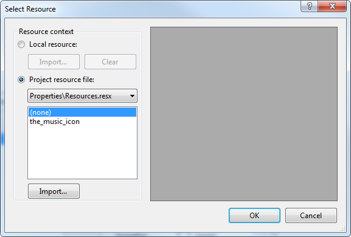

# Working with RadDropDownButton Items

The heart of RadDropDownButton is the __Items__ collection. This collection defines the menu items that appear when the RadDropDownButton is clicked. To get started, drag a __RadDropDownButton__ on the surface of your form from the Toolbox. There are two ways to add items to your new button.

## Adding Items at Design Time 

To add menu items at Design Time, click on the __Items__ property(the ellipsis button) to launch the __RadElement Collection Editor__. Click the arrow next to the __Add__ button to add items to the menu. You can add a variety of items to the collection.


Once you have added a __RadMenuItem__ to the collection, it will appear in the list on the left side of the dialog. Click the __RadMenuItem__ to edit its properties in the corresponding property grid on the right of the dialog.


In the property grid you will find many of the standard control properties, including __Text__, to control the display text of the item and __ToolTipText__ that displays when the mouse hovers over an item. Each __RadMenuItem__ you add also contains an __Items__ collection of its own, allowing you to create menu hierarchies in the __RadDropDownButton__. You can also do the following with each item:

* Associate an image to an item using the __Image__ property or associate a standard __ImageList__ component to the __RadDropDownButton__ and use the __ImageIndex__ or __ImageKey__ properties for the item. 

* __PopupDirection__ determines the direction in which the sub items of a __RadMenuItem__ will be displayed and can be __Left__, __Right__, __Up__ or __Down__.

* To display sub items in two columns set __HasTwoColumns__ to true and add items to the __RightColumnItems__ collection.

* Use __CheckOnClick__ to toggle a check mark next to a __RadMenuItem__. This property is appropriate to use when the item doesn't contain sub items.

## Adding Items at Run Time in Code

You can also add __RadDropDownButton__ items in code at Run Time. The following example code illustrates how to programmatically add a __RadMenuItem__ to your button.

__[C#] Adding RadDropDownButton items__


{{source=..\SamplesCS\Buttons\DropDownButton.cs region=creatingMenuItem}} 
{{source=..\SamplesVB\Buttons\DropDownButton.vb region=creatingMenuItem}} 

````C#
void Form1_Load(object sender, EventArgs e)
{
    RadMenuItem myRadMenuItem = new RadMenuItem();
    myRadMenuItem.Text = "My New Item";
    radDropDownButton1.Items.Add(myRadMenuItem);
    myRadMenuItem.Click += new EventHandler(myRadMenuItem_Click);
}
void myRadMenuItem_Click(object sender, EventArgs e)
{
    MessageBox.Show((sender as Telerik.WinControls.UI.RadMenuItem).Text +
        " was clicked.");
}

````
````VB.NET
Private Sub Form1_Load(ByVal sender As System.Object, ByVal e As System.EventArgs) Handles MyBase.Load
    Dim myRadMenuItem As New RadMenuItem()
    myRadMenuItem.Text = "My New Item"
    radDropDownButton1.Items.Add(myRadMenuItem)
    AddHandler myRadMenuItem.Click, AddressOf myRadMenuItem_Click
End Sub
Sub myRadMenuItem_Click(ByVal sender As Object, ByVal e As EventArgs)
    MessageBox.Show((TryCast(sender, RadMenuItem)).Text + " was clicked.")
End Sub

````

{{endregion}} 

Similarly, you can create item hierarchies in code by adding new __RadMenuItem__ objects to the __Items__ collection of your existing __RadMenuItem__.

__[C#] Adding sub items__

{{source=..\SamplesCS\Buttons\DropDownButton1.cs region=itemsHierarchy}} 
{{source=..\SamplesVB\Buttons\DropDownButton1.vb region=itemsHierarchy}} 

````C#
using Telerik.WinControls.UI;
namespace RadDropDownButtonDemo
{
    public partial class Form1 : Form
    {
        private void Form1_Load(object sender, EventArgs e)
        {
            RadMenuItem mainItem = radDropDownButton1.Items[0] as RadMenuItem;
            RadMenuItem mySubMenuItem = new RadMenuItem();
            mySubMenuItem.Text = "Submenu Item";
            mySubMenuItem.Click += new EventHandler(mySubMenuItem_Click);
            mainItem.Items.Add(mySubMenuItem);
        }
        void mySubMenuItem_Click(object sender, EventArgs e)
        {
            MessageBox.Show((sender as RadMenuItem).Text +
                " was clicked.");
        }
    }
}

````
````VB.NET
Imports System.Windows.Forms
Imports Telerik.WinControls.UI
Namespace RadDropDownButtonDemo
    Public Class Form1
        Private Sub Form1_Load(ByVal sender As Object, ByVal e As EventArgs)
            Dim mainItem As RadMenuItem = TryCast(radDropDownButton1.Items(0), RadMenuItem)
            Dim mySubMenuItem As New RadMenuItem()
            mySubMenuItem.Text = "Submenu Item"
            AddHandler mySubMenuItem.Click, AddressOf mySubMenuItem_Click
            mainItem.Items.Add(mySubMenuItem)
        End Sub
        Sub mySubMenuItem_Click(ByVal sender As Object, ByVal e As EventArgs)
            MessageBox.Show((TryCast(sender, RadMenuItem)).Text + " was clicked.")
        End Sub
    End Class
End Namespace

````

{{endregion}} 


## Displaying Images with Items

You can display images and text on your menu items.


To add an image to your menu item, click in the __Image__ property of the __RadMenuItem__, and then click the ellipsis button to launch the __Select Resource__ dialog. From this dialog you can select an image file from a project resource file or from an image resource on your local hard drive. 



## Using the Click Event

To handle the __Click__ event of individual RadMenuItems on the drop down menu at Design Time, locate the RadMenuItem in the drop down list in the __Properties__ window of the Windows Form designer. Click the events button, then double-click the __Click__ event to generate an event handler. Then fill in your event-handling code.
