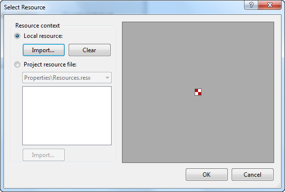

# Designing RadRadioButton 


## RadioButton Grouping

RadioButtons are grouped according to the parent. You can place a set of RadioButtons on a panel so that the choices made will be mutually exclusive, i.e. when one radio button is chosen, the others are deselected. By including multiple parents with their own RadRadioButtons you can have multiple groups of radio buttons acting independently. See the [Getting Started tutorial]() for an example.

Use __RadioCheckAlignment__to control where the radio button appears in relation to the text of the control. 


## Adding Images

To add an image to RadRadioButton, click on the __Image__ property (the ellipsis button) to launch the __Select Resource__ dialog. Use the Import button to load image files as a Local Resource, i.e. for that radio button only, or as a Project resource file where other components can share the same images.



## Text and Image Layout

Use the __TextImageRelation__ property to align the image with text. Note that the value of this property is independent of the value of __RadioCheckAlignment__. As shown in the image below, setting __RadioCheckAlignment__ to __MiddleRight__ and setting __TextImageRelation__ to __TextBeforeImage__ will result in the image being placed between the text and the check box. 	


{{source=..\SamplesCS\Buttons\RadioButtonDesigning.cs region=alignments}} 
{{source=..\SamplesVB\Buttons\RadioButtonDesigning.vb region=alignments}} 

````C#
this.radRadioButton10.RadioCheckAlignment = ContentAlignment.MiddleRight;
this.radRadioButton10.TextImageRelation = TextImageRelation.TextBeforeImage;

````
````VB.NET
Me.radRadioButton10.RadioCheckAlignment = ContentAlignment.MiddleRight
Me.radRadioButton10.TextImageRelation = TextImageRelation.TextBeforeImage

````

{{endregion}} 


## Text Entry

To add multiple lines to radio button text in code use the newline "\n" character or System.Environment.NewLine. 

__[C#] Adding multiple lines__


{{source=..\SamplesCS\Buttons\RadioButtonDesigning.cs region=settingText}} 
{{source=..\SamplesVB\Buttons\RadioButtonDesigning.vb region=settingText}} 

````C#
radRadioButton1.Text = "One line" + System.Environment.NewLine + "Another line";

````
````VB.NET
RadRadioButton1.Text = "One line" + System.Environment.NewLine + "Another line"

````

{{endregion}} 


