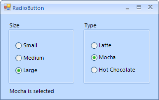

# Getting Started

You can add __RadRadioButton__ either at design time or at run time:

## Design Time

1. To add a __RadRadioButton__ to your form, drag a __RadRadioButton__ from the toolbox onto the surface of the form designer.
2. Like a standard button, you can control the displayed text by setting the __Text__ property.
3. Double click the __RadRadioButton__ at design time to generate the __ToggleStateChanged__ event.

## Run Time

To programmatically add a __RadRadioButton__ to a form, create a new instance of a __RadRadioButton__, and add it to the form __Controls__ collection.

#### Adding RadRadioButton at run time

{{source=..\SamplesCS\Buttons\RadioButton.cs region=AddProgrammatically}} 
{{source=..\SamplesVB\Buttons\RadioButton.vb region=AddProgrammatically}} 

````C#
RadRadioButton radioButton = new RadRadioButton();
radioButton.Text = "Medium size";
radioButton.ToggleState = Telerik.WinControls.Enumerations.ToggleState.On;
this.Controls.Add(radioButton);

````
````VB.NET
Dim radioButton As New RadRadioButton()
radioButton.Text = "Medium size"
radioButton.ToggleState = Telerik.WinControls.Enumerations.ToggleState.[On]
Me.Controls.Add(radioButton)

````

{{endregion}} 

The following tutorial demonstrates creating two groups of radio buttons that act independently of one another. Choices are reflected in a label as they are selected.



1\. Drop two __RadGroupBoxes__ on the form.

2\. Drop three __RadRadioButtons__ on the first groupbox. Set their __Text__ properties to "Small", "Medium" and "Large".

3\. Drop three __RadRadioButtons__ on the second groupbox. Set their Text properties to "Latte", "Mocha", and "Hot Chocolate".

4\. Drop a __RadLabel__ on the form. Set the name of the RadLabel to "lblStatus".

5\. Hold down the Shift key and select all six RadRadioButtons with the mouse.

6\. Click the __Events__ tab of the Properties Window.

7\. Double click the __ToggleStateChanged__ event to create an event handler. Replace the code with the following:
          	
#### Handling the ToggleStateChanged Event 

{{source=..\SamplesCS\Buttons\RadioButton.cs region=handlingToggleStateChanged}} 
{{source=..\SamplesVB\Buttons\RadioButton.vb region=handlingToggleStateChanged}} 

````C#
void radRadioButton1_ToggleStateChanged(object sender, StateChangedEventArgs args)
{
    lblStatus.Text = (sender as RadRadioButton).Text + " is selected";
}

````
````VB.NET
Private Sub radRadioButton1_ToggleStateChanged(ByVal sender As Object, ByVal args As StateChangedEventArgs)
    lblStatus.Text = (TryCast(sender, RadRadioButton)).Text + " is selected"
End Sub

````

{{endregion}} 

8\. Press __F5__ to run the application. Notice that selections made on radio buttons in the panel are independent of the radio button choices on the form. __RadRadioButton__ determines the radio groups by the control parent. All __RadRadioButtons__ sharing the same parent e.g. __RadGroupBox__, __RadPanel__ or a __Form__ will be part of one group.

>tip __RadRadioButtons__ are grouped according to their parent. You can place a set of __RadRadioButtons__ on a panel so that the choices made will be mutually exclusive, i.e. when one radio button is chosen, the others are deselected. By including multiple parents with their own __RadRadioButtons__ you can have multiple groups of radio buttons acting independently.
