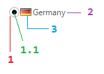

# Structure

>caption Fig.1 RadRadioButton's elements hierarchy

1. __RadRadiomark__  
	1\.1\. __RadioPrimitive__: represents the radio button's toggle primitive  
	1\.2\. __ImagePrimitive__: represents the radio button's image
2. __TextPrimitive__: represents the radio button's text
3. __ImagePrimitive__

>caption Fig.2 RadRadioButton's structure

