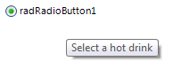

# Tooltips

There are two ways to assign tooltips to __RadRadioButton__, namely setting the __ToolTipText__ property of the __RadRadioButtonElement__, or as in most of the RadControls by using the __ToolTipTextNeeded__ event of __RadRadioButton__. It is necessary the __ShowItemToolTips__ property to be set to *true* which is the default value.

#### Setting the ToolTipText property

{{source=..\SamplesCS\Buttons\RadioButton.cs region=SetToolTipText}} 
{{source=..\SamplesVB\Buttons\RadioButton.vb region=SetToolTipText}}

````C#
this.radRadioButton1.ButtonElement.ToolTipText = "sample tooltip";

````
````VB.NET
Me.radRadioButton1.ButtonElement.ToolTipText = "sample tooltip"

````

{{endregion}} 


#### Setting tool tips in the ToolTipTextNeeded event

{{source=..\SamplesCS\Buttons\RadioButton.cs region=ToolTipTextNeeded}} 
{{source=..\SamplesVB\Buttons\RadioButton.vb region=ToolTipTextNeeded}}

````C#
private void RadRadioButton1_ToolTipTextNeeded(object sender, Telerik.WinControls.ToolTipTextNeededEventArgs e)
{
    e.ToolTipText = "Select a hot drink";
}

````
````VB.NET
Private Sub RadRadioButton1_ToolTipTextNeeded(sender As Object, e As Telerik.WinControls.ToolTipTextNeededEventArgs)
    e.ToolTipText = "Select a hot drink"
End Sub

````

{{endregion}} 



>tip The __ToolTipTextNeeded__ event has higher priority and overrides the tool tips set in the __ToolTipText__ property.

