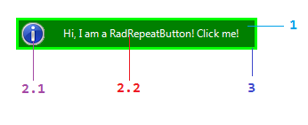

# Structure

This article will show the internal elements structure of __RadRepeatButton__:

>caption Fig.1 RadRepeatButton's elements hierarchy

1. __FillPrimitive__: represents the repeat button's filling
1. __ImageAndTextLayoutPanel__  
	2\.1\. __ImagePrimitive__: represents the repeat button's image 
	2\.2\. __TextPrimitive__: represents the repeat button's text
3. __BorderPrimitive__: represents's the repeat button's border

>caption Fig.2 RadRepeatButton's structure

 
