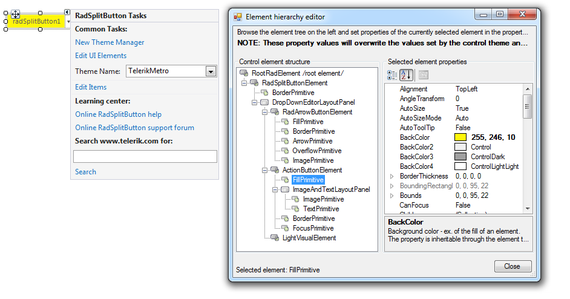
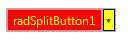

 
# Accessing and Customizing Elements
 
Accessing and customizing elements can be performed either at design time, or at run time. Before proceeding with this topic, it is recommended to get familiar with the [visual structure]() of the __RadSplitButton__.
      

## Design time

You can access and modify the style for different elements in __RadSplitButton__ by using the Element hierarchy editor.

>caption Fig.1 Element hierarchy editor



## Programmatically

You can customize the nested elements at run time as well:
>caption Fig.2 Customize elements



#### Customize elements 

{{source=..\SamplesCS\Buttons\SplitButton.cs region=AccessingCustomizingElements}} 
{{source=..\SamplesVB\Buttons\SplitButton.vb region=AccessingCustomizingElements}} 

````C#
this.radSplitButton1.DropDownButtonElement.ActionButton.ButtonFillElement.BackColor = Color.Red;
this.radSplitButton1.DropDownButtonElement.ActionButton.ForeColor = Color.Yellow;
this.radSplitButton1.DropDownButtonElement.ArrowButton.Fill.BackColor = Color.Yellow;
this.radSplitButton1.DropDownButtonElement.ArrowButton.Border.BoxStyle = Telerik.WinControls.BorderBoxStyle.SingleBorder;
this.radSplitButton1.DropDownButtonElement.ArrowButton.Border.ForeColor = Color.Black;

````
````VB.NET
Me.radSplitButton1.DropDownButtonElement.ActionButton.ButtonFillElement.BackColor = Color.Red
Me.radSplitButton1.DropDownButtonElement.ActionButton.ForeColor = Color.Yellow
Me.radSplitButton1.DropDownButtonElement.ArrowButton.Fill.BackColor = Color.Yellow
Me.radSplitButton1.DropDownButtonElement.ArrowButton.Border.BoxStyle = Telerik.WinControls.BorderBoxStyle.SingleBorder
Me.radSplitButton1.DropDownButtonElement.ArrowButton.Border.ForeColor = Color.Black
'#End Region
'#Region "SetToolTipText"
Me.radSplitButton1.DropDownButtonElement.ToolTipText = "sample tooltip"
'#End Region
End Sub
'#Region "ToolTipTextNeeded"
Private Sub RadSplitButton1_ToolTipTextNeeded(sender As Object, e As Telerik.WinControls.ToolTipTextNeededEventArgs)
Dim actionButtonElement As ActionButtonElement = TryCast(sender, ActionButtonElement)
Dim arrowButtonElement As RadArrowButtonElement = TryCast(sender, RadArrowButtonElement)
If actionButtonElement IsNot Nothing Then
    e.ToolTipText = "ActionButtonElement"
ElseIf arrowButtonElement IsNot Nothing Then
    e.ToolTipText = "RadArrowButtonElement"
End If
End Sub
'#End Region
'#region items
Private Sub Form1_Load(ByVal sender As System.Object, ByVal e As System.EventArgs) Handles MyBase.Load
Dim myRadMenuItem As New RadMenuItem()
myRadMenuItem.Text = "My New Item"
AddHandler myRadMenuItem.Click, AddressOf myRadMenuItem_Click
radSplitButton1.Items.Add(myRadMenuItem)
End Sub
Sub myRadMenuItem_Click(ByVal sender As Object, ByVal e As EventArgs)
MessageBox.Show((TryCast(sender, RadMenuItem)).Text)
End Sub

````

{{endregion}}  
