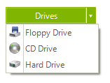

# SplitButton

## 

__RadSplitButton__ provides a menu-like interface contained within a button that can be placed anywhere on a form.

Each of the items on the __RadSplitButton__ can be set to perform an action when clicked. In addition, the items can contain other items, allowing you to create any hierarchy that fits your needs. Like a standard button, you control the displayed text by setting the __Text__ property. Unlike a standard button, __RadSplitButton__ displays drop-down items when clicked, so handling the Click event is not appropriate. Instead, work directly with the events of the items. To learn how to create and use items see [Working with Telerik RadSplitButton Items]().

RadSplitButton is visually indistinguishable from [RadDropDownButton](), but there is an important programmatic distinction. On __RadSplitButton__ you set a __DefaultItem__ property to indicate the item whose Click event should be triggered when the button is clicked. The functionality of RadSplitButton is "split" between the button itself and the dropdown menu.
