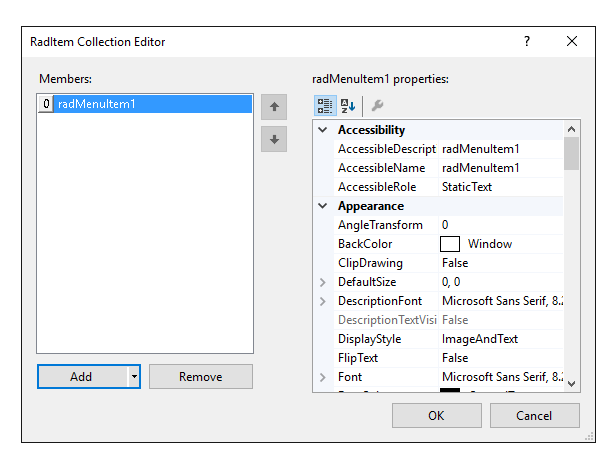
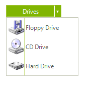
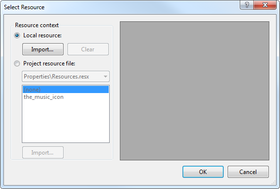

# Working with RadSplitButton Items


The heart of __RadSplitButton__ is the __Items__ collection. This collection defines the menu items that appear when the __RadSplitButton__is clicked. There are two ways to add items to a __RadSplitButton__.

## Adding Items at Design-time in the UI

To add menu items at design-time, click in the __Items__ property, and then click the ellipsis button to launch the __RadElement Collection Editor__. Click the arrow next to the __Add__ button to add items to the menu. You can add a variety of items, such as the __RadMenuItem,__ to the collection.

Once you have added a __RadMenuItem__ to the collection, it will appear in the list on the left side of the dialog. Click the __RadMenuItem__ you wish to edit and its property grid will be accessible on the right side of the dialog.

In the property grid you will find many of the standard control properties, including __Text__, to control the display text of the item and __ToolTipText__that displays when the mouse hovers over an item. Each __RadMenuItem__ also contains an __Items__ collection of its own, allowing you to create menu hierarchies within a __RadSplitButton__. Other significant properties for __RadSplitButton__ items are:

* Associate an image with each item using the __Image__ property or associate a standard __ImageList__ component to the __RadSplitButton__ and use the __ImageIndex__ or __ImageKey__ properties for the item. 

* __PopupDirection__determines the relationship that sub items of a __RadMenuItem__will display in and can be __Left__, __Right__, __Up__or __Down.__

* To display sub items in two columns set __HasTwoColumns__to true and add items to the __RightColumnItems__collection.

* Use __CheckOnClick__to toggle a check mark next to a __RadMenuItem__. This property is appropriate to use when the item doesn't contain sub items.

## Adding Items at Run Time in Code

You can also add items to RadSplitButton in code at run time. The following example code illustrates programmatically adding a __RadMenuItem__ to your button.#_[C#] Adding a RadMenuItem_

	


{{source=..\SamplesCS\Buttons\SplitButton.cs region=items}} 
{{source=..\SamplesVB\Buttons\SplitButton.vb region=items}} 

````C#

        private void Form1_Load(object sender, EventArgs e)
        {
            RadMenuItem myRadMenuItem = new RadMenuItem();
            myRadMenuItem.Text = "My New Item";
            myRadMenuItem.Click += new EventHandler(myRadMenuItem_Click);
            radSplitButton1.Items.Add(myRadMenuItem);
        }

        void myRadMenuItem_Click(object sender, EventArgs e)
        {
            MessageBox.Show((sender as RadMenuItem).Text);
        }
````
````VB.NET

    Private Sub Form1_Load(ByVal sender As System.Object, ByVal e As System.EventArgs) Handles MyBase.Load
        Dim myRadMenuItem As New RadMenuItem()
        myRadMenuItem.Text = "My New Item"
        AddHandler myRadMenuItem.Click, AddressOf myRadMenuItem_Click
        radSplitButton1.Items.Add(myRadMenuItem)
    End Sub

    Sub myRadMenuItem_Click(ByVal sender As Object, ByVal e As EventArgs)
        MessageBox.Show((TryCast(sender, RadMenuItem)).Text)
    End Sub

    '
````

{{endregion}} 


Create item hierarchies in code by adding new __RadMenuItem__ objects to the __Items__ collection of your existing __RadMenuItem__.#_[C#] Adding a sub item_

	


{{source=..\SamplesCS\Buttons\SplitButton1.cs region=subitems}} 
{{source=..\SamplesVB\Buttons\SplitButton1.vb region=subitems}} 

````C#

        private void Form1_Load(object sender, EventArgs e)
        {
            radSplitButton1.Items.Add(new RadMenuItem("AAA"));

            RadMenuItem mySubMenuItem = new RadMenuItem();
            mySubMenuItem.Text = "Submenu Item";
            mySubMenuItem.Click += new EventHandler(mySubMenuItem_Click);
            RadMenuItem mainItem = radSplitButton1.Items[0] as RadMenuItem;
            mainItem.Items.Add(mySubMenuItem);
        }

        void mySubMenuItem_Click(object sender, EventArgs e)
        {
            MessageBox.Show((sender as RadMenuItem).Text);
        }
````
````VB.NET

    Private Sub Form1_Load(ByVal sender As System.Object, ByVal e As System.EventArgs) Handles MyBase.Load
        Dim mySubMenuItem As New RadMenuItem()
        mySubMenuItem.Text = "Submenu Item"
        AddHandler mySubMenuItem.Click, AddressOf mySubMenuItem_Click
        Dim mainItem As RadMenuItem = TryCast(radSplitButton1.Items(0), RadMenuItem)
        mainItem.Items.Add(mySubMenuItem)
    End Sub

    Sub mySubMenuItem_Click(ByVal sender As Object, ByVal e As EventArgs)
        MessageBox.Show((TryCast(sender, RadMenuItem)).Text)
    End Sub

    '
````

{{endregion}} 


## Displaying Images with Items

You can display images as well as text on your menu items.

To add an image to your menu item, click in the __Image__ property of the __RadMenuItem__, and then click the ellipsis button to launch the __Select Resource__ dialog.

From this dialog you can select an image file from a project resource file or from an image resource on your local hard drive. 

## Using the Click Event

To handle the __Click__ event of RadMenuItems on the drop down menu, locate the __RadMenuItem__ in the drop down list in the Properties window of the Windows Form designer. Click the events button, then double-click the __Click__ event to generate an event handler. Fill in the details of your event-handling code.

## Setting the Default Item

The default item is the item whose __Click__ event is triggered by the user pressing the button, instead of choosing from the menu. The DefaultItem can be assigned in code: #_[C#] Assigning the default item_

	


{{source=..\SamplesCS\Buttons\SplitButton1.cs region=mainItem}} 
{{source=..\SamplesVB\Buttons\SplitButton1.vb region=mainItem}} 

````C#

            radSplitButton1.DefaultItem = mainItem;
````
````VB.NET

        radSplitButton1.DefaultItem = mainItem

        '
````

{{endregion}} 


