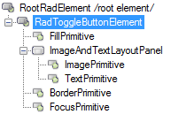

# Structure

>caption Fig.1 RadToggleButton's elements hierarchy
>

1. __FillPrimitive__: represents the toggle button's filling
1. __ImageAndTextLayoutPanel__  
	2\.1\. __ImagePrimitive__: represents the toggle button's image 
	2\.2\. __TextPrimitive__: represents the toggle button's text
3. __BorderPrimitive__: represents's the toggle button's border

>caption Fig.2 RadToggleButton's structure

