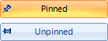

# ToggleButton

## 

__RadToggleButton__ is designed to manage states on your form. It shares many features with the [RadCheckBox](), but provides a different visual effect than the standard check mark. 

To learn how to act on state changes and alter the appearance of RadToggleButton for different states, see [Handling the ToggleButton States]().
