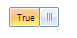
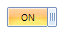
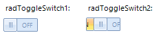
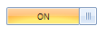
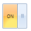

# Properties, Methods and Events


## Properties

* __OnText__: gets or sets the text displayed when the state is On. The default string is *"ON"*.
            
>caption Fig.1 RadToggleSwitch.OnText

 

{{source=..\SamplesCS\Buttons\ToggleSwitch.cs region=OnText}} 
{{source=..\SamplesVB\Buttons\ToggleSwitch.vb region=OnText}} 

````C#
            
this.radToggleSwitch1.OnText = "True";

````
````VB.NET
Me.RadToggleSwitch1.OnText = "True"

````

{{endregion}} 


* __OffText__: gets or sets the text displayed when the state is Off. The default string is *"OFF"*.
            
>caption Fig.2 RadToggleSwitch.OffText

 

{{source=..\SamplesCS\Buttons\ToggleSwitch.cs region=OffText}} 
{{source=..\SamplesVB\Buttons\ToggleSwitch.vb region=OffText}} 

````C#
            
this.radToggleSwitch1.OffText = "False";

````
````VB.NET
Me.RadToggleSwitch1.OffText = "False"

````

{{endregion}} 


* __ThumbTickness__: gets or sets width of the thumb. Its default value is *20*.
            
>caption Fig.3 RadToggleSwitch.ThumbTickness

 

{{source=..\SamplesCS\Buttons\ToggleSwitch.cs region=ThumbTickness}} 
{{source=..\SamplesVB\Buttons\ToggleSwitch.vb region=ThumbTickness}} 

````C#
            
this.radToggleSwitch1.ThumbTickness = 10;

````
````VB.NET
Me.RadToggleSwitch1.ThumbTickness = 10

````

{{endregion}} 


* __SwitchElasticity__: determines how far the switch needs to be dragged before it snaps to the opposite side. Its default value is *0.5*

* __Value__: gets or sets a boolean value. Its default value is *true*.
            

* __AllowAnimation__: gets or sets a value indicating whether to use animation when changing its state.
            
>caption Fig.4 Set the AllowAnimation property

 

{{source=..\SamplesCS\Buttons\ToggleSwitch.cs region=AllowAnimation}} 
{{source=..\SamplesVB\Buttons\ToggleSwitch.vb region=AllowAnimation}} 

````C#
            
this.radToggleSwitch1.AllowAnimation = false;
this.radToggleSwitch2.AllowAnimation = true;

````
````VB.NET
Me.RadToggleSwitch1.AllowAnimation = False
Me.RadToggleSwitch2.AllowAnimation = True

````

{{endregion}} 


* __AnimationFrames__: gets or sets the animation frames. Its default value is *20*.
            

* __IsAnimating__: gets a value indicating whether the control is currently animating.
            

* __OnElement__: gets the on element of __RadToggleSwitch__.
            

* __OffElement__: gets the off element of __RadToggleSwitch__.
            

* __Thumb__: gets the thumb of __RadToggleSwitch__.
            

* __Width__: gets or sets the width of __RadToggleSwitch__.
            
>caption Fig.5 Set the Width property

 

{{source=..\SamplesCS\Buttons\ToggleSwitch.cs region=Width}} 
{{source=..\SamplesVB\Buttons\ToggleSwitch.vb region=Width}} 

````C#
            
this.radToggleSwitch1.Width = 100;

````
````VB.NET
Me.RadToggleSwitch1.Width = 100

````

{{endregion}} 


* __Height__: gets or sets the height of __RadToggleSwitch__.
            
>caption Fig.6 Set the Height property

 

{{source=..\SamplesCS\Buttons\ToggleSwitch.cs region=Height}} 
{{source=..\SamplesVB\Buttons\ToggleSwitch.vb region=Height}} 

````C#
            
this.radToggleSwitch1.Height = 50;

````
````VB.NET
        
Me.RadToggleSwitch1.Height = 50

````

{{endregion}} 


## Methods

* __Toggle()__: toggles the value of __RadToggleSwitch__.
            

* __Toggle(bool animate)__: toggles the value of __RadToggleSwitch__ indicating whether to use animation.
            

* __SetToggleState(bool newValue)__: sets the value of __RadToggleSwitch__ passing the new value as parameter.
            

* __SetToggleState(bool newValue, bool animate)__: sets the value of __RadToggleSwitch__. The first parameter specifies the new value and the second one indicates whether to use animation.
            

## Events

* __ValueChanging__: it is a cancelable event which occurs when the __Value__ is about to change.
            

* __ValueChanged__: occurs when the __Value__ has changed.
            
