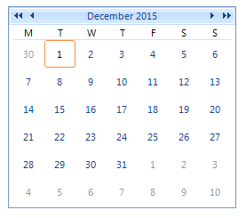

# Calendar

| RELATED VIDEOS |  |
| ------ | ------ |
|[Using RadCalendar for WinForms](http://tv.telerik.com/watch/winforms/radcalendar/using-radcalendar-for-winforms) In this video, you'll get an overview of using __RadCalendar__ for WinForms, configuring important properties, using `Special Days` and `Selected Days`, styling, responding to events with style changes. (Runtime: 10:23)||

__RadCalendar__ supports all common features you would find in the standard Month Calendar control, such as first day of week, show today, special days, and show/hide week numbers, but adds several nifty features you will not find in the Visual Studio toolbox, such as focused date, show/hide week days, fish eye (date zoom functionality), read-only support, and show other month days. We went even further and extended the calendar functionality with footer support, controllable header/footer, fast navigation buttons, and full control over cell formatting (paddings, borders, margins, spacings, alignment, etc), making __RadCalendar__ a feature-complete control with expected behavior, which your users will truly appreciate.

## See Also

* [Getting Started]()
* [Localization] ()
