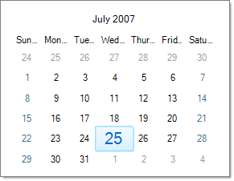

# Zooming

## 

__RadCalendar__ has a built-in zooming functionality.The  __Zoom-In__ operation is activated by holding the left mouse button on a particular calendar cell. The __Zoom-Out__ operation is activated when the left mouse button is released. The following properties control zooming:

* __AllowFishEye__ - enables the zooming functionality 

* __ZoomingFactor__ - gets or sets the zooming factor of a cell which is handled by the zooming (fish eye) functionality. 

The screenshot below shows a calendar with zoomed-in date.

