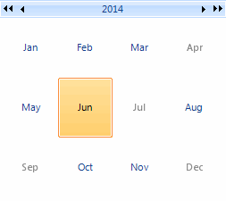

# Customizing Zoom Navigation


## 

This article will guide you through the process of creating a month-year picker. For this purpose, it is necessary to set the __HeaderNavigationMode__
        property to HeaderNavigationMode.*Zoom* and set the __ZoomLevel__ property to ZoomLevel.*Months*. 
        This will allow the user to select a specific __CalendarCellElement__ and navigate upwards/downwards in the __RadCalendar__ similar to Windows calendar. #_[C#]_

	


{{source=..\SamplesCS\Calendar\Calendar1.cs region=monthYearPicker}} 
{{source=..\SamplesVB\Calendar\Calendar1.vb region=monthYearPicker}} 

````C#

            this.radCalendar1.HeaderNavigationMode = HeaderNavigationMode.Zoom;
            this.radCalendar1.ZoomLevel = ZoomLevel.Months;

            this.radCalendar1.ZoomChanging += new CalendarZoomChangingEventHandler(radCalendar1_ZoomChanging);
````
````VB.NET

        Me.RadCalendar1.HeaderNavigationMode = HeaderNavigationMode.Zoom
        Me.RadCalendar1.ZoomLevel = ZoomLevel.Months

        AddHandler Me.RadCalendar1.ZoomChanging, AddressOf radCalendar1_ZoomChanging

        '#End Region

    End Sub

    '#Region monthYearPickerEvent

    Private Sub radCalendar1_ZoomChanging(sender As Object, e As CalendarZoomChangingEventArgs)
        If Me.RadCalendar1.ZoomLevel = ZoomLevel.Years AndAlso e.Direction = DrillDirection.Up Then
            e.Cancel = True
        End If
        If Me.RadCalendar1.ZoomLevel = ZoomLevel.Months AndAlso e.Direction = DrillDirection.Down Then
            e.Cancel = True
        End If
    End Sub
    '#End Region

    '#region iteratingSpecialSelected
    Private Sub radButton1_Click(ByVal sender As Object, ByVal e As EventArgs)
        For Each dateTime As DateTime In RadCalendar1.SelectedDates
            RadListControl1.Items.Add(New RadListDataItem("Selected: " + dateTime.ToShortDateString()))
        Next
        For Each day As RadCalendarDay In RadCalendar1.SpecialDays
            RadListControl1.Items.Add(New RadListDataItem("Special: " + day.[Date].ToShortDateString()))
        Next
    End Sub
    '
````

{{endregion}} 


In addition, you should subscribe to the __ZoomChanging__ event and stop navigation from the currently selected month to its days
        representation and from a year to a range of years.#_[C#]_

	


{{source=..\SamplesCS\Calendar\Calendar1.cs region=monthYearPickerEvent}} 
{{source=..\SamplesVB\Calendar\Calendar1.vb region=monthYearPickerEvent}} 

````C#

        void radCalendar1_ZoomChanging(object sender, CalendarZoomChangingEventArgs e)
        {
            if (this.radCalendar1.ZoomLevel == ZoomLevel.Years && e.Direction == DrillDirection.Up) 
            {
                e.Cancel = true;
            }
            if (this.radCalendar1.ZoomLevel == ZoomLevel.Months && e.Direction == DrillDirection.Down) 
            {
                e.Cancel = true;
            }
        }
````
````VB.NET

    Private Sub radCalendar1_ZoomChanging(sender As Object, e As CalendarZoomChangingEventArgs)
        If Me.RadCalendar1.ZoomLevel = ZoomLevel.Years AndAlso e.Direction = DrillDirection.Up Then
            e.Cancel = True
        End If
        If Me.RadCalendar1.ZoomLevel = ZoomLevel.Months AndAlso e.Direction = DrillDirection.Down Then
            e.Cancel = True
        End If
    End Sub
    '#End Region

    '#region iteratingSpecialSelected
    Private Sub radButton1_Click(ByVal sender As Object, ByVal e As EventArgs)
        For Each dateTime As DateTime In RadCalendar1.SelectedDates
            RadListControl1.Items.Add(New RadListDataItem("Selected: " + dateTime.ToShortDateString()))
        Next
        For Each day As RadCalendarDay In RadCalendar1.SpecialDays
            RadListControl1.Items.Add(New RadListDataItem("Special: " + day.[Date].ToShortDateString()))
        Next
    End Sub
    '
````

{{endregion}} 



