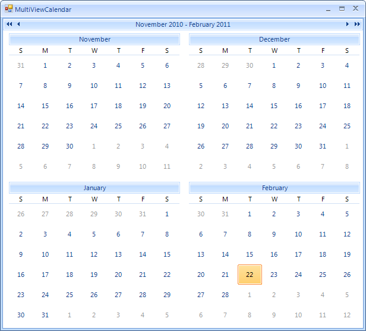

# MultiView Mode


## 

RadCalendar can be configured to show more than one month in the calendar area. To enable this functionality set the __AllowMultipleView__ property to true, then set integer properties __MultiViewColumns__ and __MultiViewRows__ to the number of calendar month views you wish to have displayed. The position of the month view that contains the selected date is controlled by the __CurrentViewRow__ and __CurrentViewColumn__ properties.



The code sample below shows how multiple views can be configured and positioned.Here the CurrentViewRow and CurrentViewColumn are set to zero, i.e. that is the first row and column. The selected date is shown in the upper left month view. 


__Configuring multiple views__


{{source=..\SamplesCS\Calendar\MultiViewCalendar.cs region=multiView}} 
{{source=..\SamplesVB\Calendar\MultiViewCalendar.vb region=multiView}} 

````C#
radCalendar1.AllowMultipleView = true;
radCalendar1.MultiViewColumns = 3;
radCalendar1.MultiViewRows = 3;
radCalendar1.CurrentViewColumn = 0;
radCalendar1.CurrentViewRow = 0;

````
````VB.NET
RadCalendar1.AllowMultipleView = True
RadCalendar1.MultiViewColumns = 3
RadCalendar1.MultiViewRows = 3
RadCalendar1.CurrentViewColumn = 0
RadCalendar1.CurrentViewRow = 0

````

{{endregion}} 


