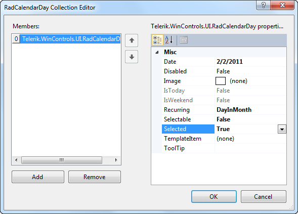

# Adding Special Days

## 

"Special days" correspond to public holidays, vacation days, birth days, etc. and are usually marked in a calendar for planning and scheduling purposes. Click the ellipses for the __SpecialDays__ property in the Properties Window to add, remove and configure special days. The __Special Days Collection____Editor__allows you to: 

* Click the __Add__ button to append a __RadCalendarDay__ object to the collection.
            

* Click the __Remove__ button to delete the selected day from the collection.
            

* Use the up and down arrow keys to reorder special days in the collection. 

* Configure a selected __RadCalendarDay__ including assign an __Image__, set the day to __Disabled__, [set the Recurring enumeration](), determine if the day is __Selectable__, if it is __Selected__and assign a __ToolTip__. Assign __TemplateItems__ if __RadHostItems__ are available, otherwise see [Using Templates]() for how to do this in code.
             
