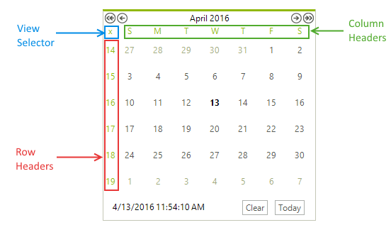

# Column and Row Headers

__RadCalendar__ supports row and column headers that can be enabled by setting the __ShowRowHeaders__, __ShowColumnHeaders__ and __ShowViewSelector__ properties:

>caption The column/row headers and the view selector


{{source=..\SamplesCS\Calendar\ColumnRowHeaders.cs region=showingHeaders}} 
{{source=..\SamplesVB\Calendar\ColumnRowHeaders.vb region=showingHeaders}} 

````C#
this.radCalendar1.ShowRowHeaders = true;
this.radCalendar1.ShowColumnHeaders = true;
this.radCalendar1.ShowViewSelector = true;

````
````VB.NET
Me.RadCalendar1.ShowRowHeaders = True
Me.RadCalendar1.ShowColumnHeaders = True
Me.RadCalendar1.ShowViewSelector = True

````

{{endregion}} 

These headers can be used as selectors which allow you to quickly select groups of days in multi-select mode. The __ViewSelector__ allows you to select the whole month view at once.


{{source=..\SamplesCS\Calendar\ColumnRowHeaders.cs region=allowMultiSelect}} 
{{source=..\SamplesVB\Calendar\ColumnRowHeaders.vb region=allowMultiSelect}} 

````C#
this.radCalendar1.AllowMultipleSelect = true;
this.radCalendar1.AllowColumnHeaderSelectors = true;
this.radCalendar1.AllowRowHeaderSelectors = true;

````
````VB.NET
Me.RadCalendar1.AllowMultipleSelect = True
Me.RadCalendar1.AllowColumnHeaderSelectors = True
Me.RadCalendar1.AllowRowHeaderSelectors = True

````

{{endregion}} 
>caption Selecting specific day with column header


## See Also

* [Header]()
* [Footer]()
* [Keyboard Navigation]()
* [MultiView]()
* [Navigation]()
* [Repeating Events]()
* [Selecting Dates]()
* [Zoom]()

