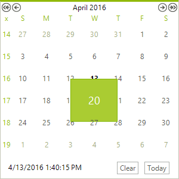

## FishEye Effect

__RadCalendar__ has a built-in date zoom functionality.The  __Zoom-In__ operation is activated by holding the left mouse button on a particular calendar cell. The __Zoom-Out__ operation is activated when the left mouse button is released. The following properties control zooming:

* __AllowFishEye:__ Enables the zooming functionality.

* __ZoomingFactor:__ Gets or sets the zooming factor of a cell which is handled by the zooming (fish eye) functionality. 

>caption Figure 1: Calendar with a zoomed-in date.

## Navigation Zoom

The zoom functionality supports changing the current view type as well. With this functionality you are able to switch between Day, Month, and Year view by just clinking the header. This functionality is controlled by the following properties: 
* __HeaderNavigationMode:__ Specifies the navigation mode that will be used when user clicks on header element.

* __ZoomLevel:__ Get or sets the current level. The possible values are, *Days*, *Months*, *Years* and *YearRanges*.

>caption Figure 2: Header zoom navigation mode

>caution
Zoom navigation mode is not supporting in MultipleView of RadCalendar.
>

## See Also

* [Header]()
* [Footer]()
* [Keyboard Navigation]()
* [MultiView]()
* [Navigation]()
* [Repeating Events]()
* [Selecting Dates]()
* [Column and Row Headers]()
