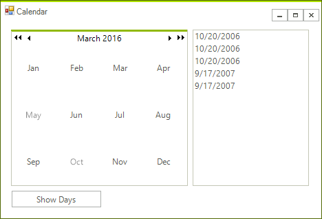
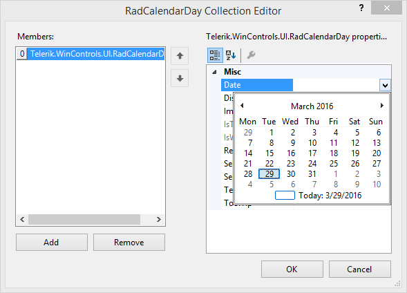
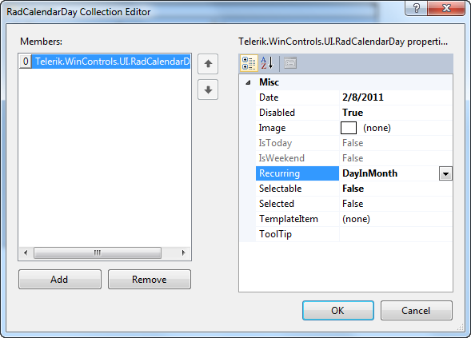

# Getting Started


This tutorial will demonstrate adding selected and special days to the calendar at design time, then iterating and displaying those dates at runtime.


1. In a new Windows Application form drop a __RadCalendar__ control. Set the __AllowMultipleSelect__ property to *true*.
          

1. Drop a __RadListControl__ and __RadButton__ to the form.

1. In the `Properties` window click the ellipses for the __SelectedDates__ property of the __RadCalendar__.

1. Click the __Add__ button to append a new selected date to the collection. In the __Value__ property for the date select "Today" from the drop-down calendar.

1. Add two more selected dates and set their __Value__ properties to the two days following "Today".
 

1. In the `Properties` window click the ellipses for the __SpecialDays__ property of the __RadCalendar__. 


1. Click the __Add__ button to append a new __RadCalendarDay__ to the collection.

1. Set the __Date__ property for the special day to the last day of the month.

1. Set the __Disabled__ property to true and the __Recurring__ property to __DayInMonth.__
 

1. Double-Click the __RadButton__ in the designer and add the following code to the __Click__ event handler. This code will iterate and list results for the __SelectedDates__ and __SpecialDays__ collections.


#### Iterating the SelectedDates and SpecialDates collections

{{source=..\SamplesCS\Calendar\Calendar1.cs region=iteratingSpecialSelected}} 
{{source=..\SamplesVB\Calendar\Calendar1.vb region=iteratingSpecialSelected}} 

````C#
private void radButton1_Click(object sender, EventArgs e)
{
    foreach (DateTime dateTime in radCalendar1.SelectedDates)
    {
        radListControl1.Items.Add(
          new RadListDataItem("Selected: " + dateTime.ToShortDateString()));
    }
    foreach (RadCalendarDay day in radCalendar1.SpecialDays)
    {
        radListControl1.Items.Add(
          new RadListDataItem("Special: " + day.Date.ToShortDateString()));
    }
}

````
````VB.NET
Private Sub radButton1_Click(ByVal sender As Object, ByVal e As EventArgs)
    For Each dateTime As DateTime In RadCalendar1.SelectedDates
        RadListControl1.Items.Add(New RadListDataItem("Selected: " + dateTime.ToShortDateString()))
    Next
    For Each day As RadCalendarDay In RadCalendar1.SpecialDays
        RadListControl1.Items.Add(New RadListDataItem("Special: " + day.[Date].ToShortDateString()))
    Next
End Sub

````

{{endregion}} 


Run the application. Notice the three selected and the highlighted special day. Use the navigation buttons at the top of the calendar ">" to move to another month. Because you set the special day __Recurring__ property to *DayInMonth*, the special day is highlighted in every month. 
        
        


| RELATED VIDEOS |  |
| ------ | ------ |
|[Using RadCalendar for WinForms](http://tv.telerik.com/winforms/radcalendar/using-radcalendar-for-winforms) In this video, you'll get an overview of using RadCalendar for WinForms; configuring important properties; using Special Days and Selected Days; styling; responding to Events with style changes. (Runtime: 10:23)||

## See Also

* [Structure]()

* [Adding Selected Dates]()

* [Adding Spacial Days]()
* [Properties and Events]()
* [Formatting Items ]()


