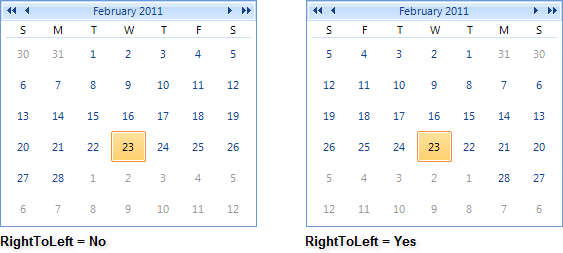

# Right-To-Left Support

## 

RadCalendar fully supports right-to-left (RTL) language locales. You can enable/disable the right-to-left support using the __RightToLeft__ enumeration, which has two members: __Yes__, __No__.

#### __[C#] Assigning RightToLeft__

{{region rtl}}
	            radCalendar1.RightToLeft = RightToLeft.Yes;
	{{endregion}}

#### __[VB.NET] CAssigning RightToLeft__

{{region rtl}}
	        RadCalendar1.RightToLeft = RightToLeft.Yes
	{{endregion}}

