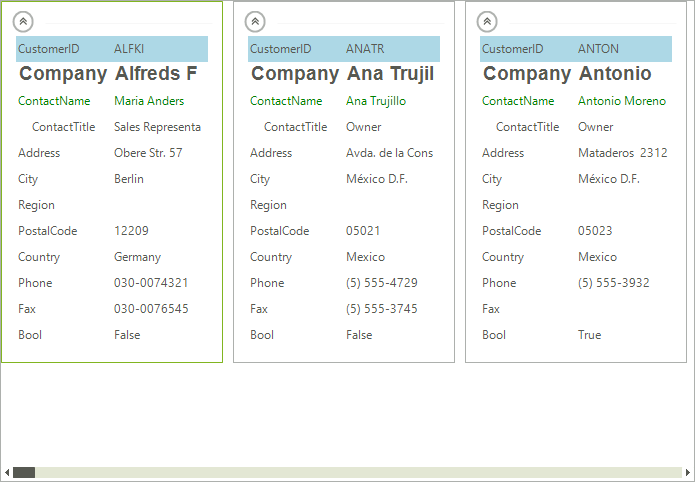

# Visual Data Representation

This article requires that readers are familiar with the workings of the [TPF]() property system.

__RadCardView__ synchronizes the most important __RadProperties__ between the different __RadCardViewItems__, meaning that a change in certain __RadProperty__ of a particular __CardViewItem__ affects the other items as well. The list below contains the properties which are synchronized by default.

* __VisualElement.BackColorProperty__
* __LightVisualElement.BackColor2Property__
* __LightVisualElement.BackColor3Property__
* __LightVisualElement.BackColor4Property__
* __LightVisualElement.NumberOfColorsProperty__
* __LightVisualElement.DrawFillProperty__
* __VisualElement.ForeColorProperty__
* __VisualElement.FontProperty__
* __LightVisualElement.TextWrapProperty__
* __LightVisualElement.DrawTextProperty__
* __LightVisualElement.TextAlignmentProperty__
* __LightVisualElement.ImageAlignmentProperty__
* __LightVisualElement.TextImageRelationProperty__
* __LightVisualElement.BorderColorProperty__
* __LightVisualElement.DrawBorderProperty__
* __LightVisualElement.BorderWidthProperty__
* __LightVisualElement.GradientStyleProperty__
* __LightVisualElement.GradientPercentageProperty__
* __LightVisualElement.GradientPercentage2Property__ 

The collection with these __RadProperties__ is static and it it accessible, therefore changes of the collection are possible. The example below adds the __LightVisualElement.VisibilityProperty__ and sets others in order to customize the appearance of the items.

>caption Fig.1 Modifying RadProperties


#### Formatting the Visual Item

{{source=..\SamplesCS\CardView\CardviewCustomizingAppearance.cs region=CustomizeAppearance}} 
{{source=..\SamplesVB\CardView\CardviewCustomizingAppearance.vb region=CustomizeAppearance}} 

````C#
public CardviewCustomizingAppearance()
{
    InitializeComponent();
    CardListViewElement.ItemSynchronizationProperties.Add(LightVisualElement.VisibilityProperty);
    this.CustomizeAppearance();
}
private void CustomizeAppearance()
{
    LayoutControlGroupItem group = this.radCardView1.CardTemplate.Items[0] as LayoutControlGroupItem;
    CardViewItem item = (CardViewItem)group.Items[3];
    item.TextAlignment = ContentAlignment.MiddleCenter;
    item = (CardViewItem)group.Items[2];
    item.ForeColor = Color.Green;
    item = (CardViewItem)group.Items[1];
    item.Font = new Font("Arial", 14, FontStyle.Bold);
    item = (CardViewItem)group.Items[0];
    item.DrawFill = true;
    item.BackColor = Color.LightBlue;
    item.GradientStyle = GradientStyles.Solid;
    item = (CardViewItem)group.Items.Last;
    item.Visibility = ElementVisibility.Hidden;
}

````
````VB.NET
Public Sub New()
    InitializeComponent()
    CardListViewElement.ItemSynchronizationProperties.Add(LightVisualElement.VisibilityProperty)
    Me.CustomizeAppearance()
End Sub
Private Sub CustomizeAppearance()
    Dim group As LayoutControlGroupItem = TryCast(Me.RadCardView1.CardTemplate.Items(0), LayoutControlGroupItem)
    Dim item As CardViewItem = DirectCast(group.Items(3), CardViewItem)
    item.TextAlignment = ContentAlignment.MiddleCenter
    item = DirectCast(group.Items(2), CardViewItem)
    item.ForeColor = Color.Green
    item = DirectCast(group.Items(1), CardViewItem)
    item.Font = New Font("Arial", 14, FontStyle.Bold)
    item = DirectCast(group.Items(0), CardViewItem)
    item.DrawFill = True
    item.BackColor = Color.LightBlue
    item.GradientStyle = GradientStyles.Solid
    item = DirectCast(group.Items.Last, CardViewItem)
    item.Visibility = ElementVisibility.Hidden
End Sub

````

{{endregion}} 

## See Also

[Getting Started]()
[Structure]()
[Formatting Items]()
[Custom Items]()

