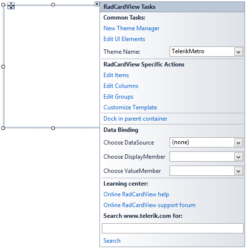

# Design Time

## Smart Tag

>caption Fig.1 Smart Tag

* __Common Tasks__

	* __New Theme Manager__: Adds a new __RadThemeManager__ component to the form.

	* __Edit UI elements__: Opens a dialog that displays the *Element Hierarchy Editor*. This editor lets you browse all the elements in the control.

	* __Theme Name__: Select a theme name from the drop down list of themes available for that control. Selecting a theme allows you to change all aspects of the controls visual style at one time.

* __RadCardView Specific Actions__:

	* __Edit Items__: When in unbound mode adds or edits __CardViewItems__

	* __Edit Columns__: Adds or edits columns

	* __Edit Groups__: Adds or edits groups
	
	* __Customize Template__: Opens the CardTemplate Layout editor
	
	The short video below demonstrates how columns can be set up at design-time and later the layout modified using the Customize Dialog.

>caption Fig.2 Create Layout

* __Data Binding__: RadCardView utilizes the standard WinForms data binding mechanism. A complete example is available in Data Binding section.

* __Learning Center__: Navigate to the Telerik help, code library projects or support forum.

* __Search__: Search the Telerik website for a given string.

# See Also

* [Getting Started]()
* [Element Hierarchy Editor]()

