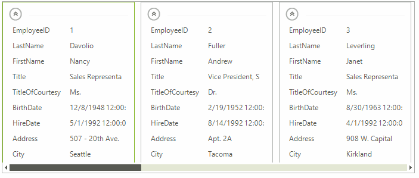

# Switching Editors

When edit operation is about to begin, the __EditorRequired__ event is fired. By using this event, you can replace the default text box editor with one of the four built-in editors that __RadCardView__ provides: __ListViewTextBoxEditor__, __ListViewDropDownListEditor__, __ListViewSpinEditor__, __ListViewDateTimeEditor__. You can also provide a custom instance as an editor. The default editor used by __RadCardView__ is __ListViewTextBoxEditor__.

>caption Fig. 1: Editor Types


The following example shows how you can change the editor type:

#### Changing Editor Type

{{source=..\SamplesCS\CardView\CardViewEditors.cs region=ChangingEditorType}} 
{{source=..\SamplesVB\CardView\CardViewEditors.vb region=ChangingEditorType}}
````C#
private void radCardView1_EditorRequired(object sender, Telerik.WinControls.UI.ListViewItemEditorRequiredEventArgs e)
{
    if (e.ListViewElement.CurrentColumn.FieldName == "TitleOfCourtesy")
    {
        ListViewDropDownListEditor editor = new ListViewDropDownListEditor();
        (editor.EditorElement as BaseDropDownListEditorElement).Items.Add("Ms.");
        (editor.EditorElement as BaseDropDownListEditorElement).Items.Add("Mr.");
        (editor.EditorElement as BaseDropDownListEditorElement).Items.Add("Mrs.");
        e.Editor = editor;
    }
    else if (e.ListViewElement.CurrentColumn.FieldName == "EmployeeID")
    {
        e.EditorType = typeof(ListViewSpinEditor);
    }
    else if (e.ListViewElement.CurrentColumn.FieldName == "BirthDate" || e.ListViewElement.CurrentColumn.FieldName == "HireDate")
    {
        e.EditorType = typeof(ListViewDateTimeEditor);
    }
    else
    {
        e.EditorType = typeof(ListViewTextBoxEditor);
    }
}

````
````VB.NET
Private Sub radCardView1_EditorRequired(sender As Object, e As Telerik.WinControls.UI.ListViewItemEditorRequiredEventArgs)
    If e.ListViewElement.CurrentColumn.FieldName = "TitleOfCourtesy" Then
        Dim editor As New ListViewDropDownListEditor()
        TryCast(editor.EditorElement, BaseDropDownListEditorElement).Items.Add("Ms.")
        TryCast(editor.EditorElement, BaseDropDownListEditorElement).Items.Add("Mr.")
        TryCast(editor.EditorElement, BaseDropDownListEditorElement).Items.Add("Mrs.")
        e.Editor = editor
    ElseIf e.ListViewElement.CurrentColumn.FieldName = "EmployeeID" Then
        e.EditorType = GetType(ListViewSpinEditor)
    ElseIf e.ListViewElement.CurrentColumn.FieldName = "BirthDate" OrElse e.ListViewElement.CurrentColumn.FieldName = "HireDate" Then
        e.EditorType = GetType(ListViewDateTimeEditor)
    Else
        e.EditorType = GetType(ListViewTextBoxEditor)
    End If
End Sub

````


{{endregion}}

## Editing Lifecycle

When an item is displayed in __RadCardView__ and the user clicks on the editor of a selected cardview item, the following steps are performed:

* The __SelectedItem__ of the control is changed.

* The __BeginEdit()__ method is called internally.

* The __ItemEditing__ event is fired. The edit operation can be canceled by setting the *Cancel* event argument to *true*.

* A text box editor appears in the selected item.

When an item is brought out of edit mode, the following steps are performed:

* The editor determines if it wants to handle the keystroke - for example Esc - cancels editing, Enter ends editing and submits changes.

* The editor instance performs the action it has defined for the __Enter__ key. Typically this indicates that edit mode should be exited and any changes made during the edit session should be saved.

* In response to the action described in the previous step the __EndEdit()__ method is called internally.

* The __ItemValidating__ event allows the user to hook up custom logic for verification. If the __ValueValidating__ event does not succeed (*e.Cancel is true*), __ValidationError__ event is fired to notify all listeners that the validation has failed.

* Follows the __ItemValueChanging__ event via which you can cancel assigning a new value to the item.

* If the previous event was not canceled, the new value is assigned to the item and the __ItemValueChanged__ event is fired.

>caption Fig. 1: Data Validation


The Following example demonstrates the __ItemValidating__ event handling integer values: 
            
#### Data Validation

{{source=..\SamplesCS\CardView\CardViewEditors.cs region=ChangingEditorType}} 
{{source=..\SamplesVB\CardView\CardViewEditors.vb region=ChangingEditorType}}
````C#
private void radCardView1_EditorRequired(object sender, Telerik.WinControls.UI.ListViewItemEditorRequiredEventArgs e)
{
    if (e.ListViewElement.CurrentColumn.FieldName == "TitleOfCourtesy")
    {
        ListViewDropDownListEditor editor = new ListViewDropDownListEditor();
        (editor.EditorElement as BaseDropDownListEditorElement).Items.Add("Ms.");
        (editor.EditorElement as BaseDropDownListEditorElement).Items.Add("Mr.");
        (editor.EditorElement as BaseDropDownListEditorElement).Items.Add("Mrs.");
        e.Editor = editor;
    }
    else if (e.ListViewElement.CurrentColumn.FieldName == "EmployeeID")
    {
        e.EditorType = typeof(ListViewSpinEditor);
    }
    else if (e.ListViewElement.CurrentColumn.FieldName == "BirthDate" || e.ListViewElement.CurrentColumn.FieldName == "HireDate")
    {
        e.EditorType = typeof(ListViewDateTimeEditor);
    }
    else
    {
        e.EditorType = typeof(ListViewTextBoxEditor);
    }
}

````
````VB.NET
Private Sub radCardView1_EditorRequired(sender As Object, e As Telerik.WinControls.UI.ListViewItemEditorRequiredEventArgs)
    If e.ListViewElement.CurrentColumn.FieldName = "TitleOfCourtesy" Then
        Dim editor As New ListViewDropDownListEditor()
        TryCast(editor.EditorElement, BaseDropDownListEditorElement).Items.Add("Ms.")
        TryCast(editor.EditorElement, BaseDropDownListEditorElement).Items.Add("Mr.")
        TryCast(editor.EditorElement, BaseDropDownListEditorElement).Items.Add("Mrs.")
        e.Editor = editor
    ElseIf e.ListViewElement.CurrentColumn.FieldName = "EmployeeID" Then
        e.EditorType = GetType(ListViewSpinEditor)
    ElseIf e.ListViewElement.CurrentColumn.FieldName = "BirthDate" OrElse e.ListViewElement.CurrentColumn.FieldName = "HireDate" Then
        e.EditorType = GetType(ListViewDateTimeEditor)
    Else
        e.EditorType = GetType(ListViewTextBoxEditor)
    End If
End Sub

````


{{endregion}}

# See Also

* [Editors Overview]()
* [Custom Items]()
* [Formatting Items]()