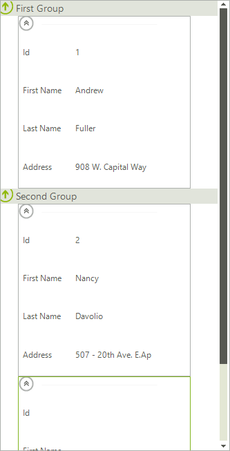

# Filtering

__RadCardView__ allows filtering applied to its __CardViewItems__. To enable filtering use the __EnableFiltering__ property of the control.

#### Enable Filtering

{{source=..\SamplesCS\CardView\CardViewFeatures.cs region=EnableFiltering}} 
{{source=..\SamplesVB\CardView\CardViewFeatures.vb region=EnableFiltering}} 

````C#
this.radCardView1.EnableFiltering = true;

````
````VB.NET
Me.RadCardView1.EnableFiltering = True

````

{{endregion}} 

Once the filtering is enabled, we have to create a new __FilterDescriptor__ and assign its __PropertyName__, __FilterOperator__ and __SearchCriteria__. First, let’s filter the items by their value and look for items containing with `Capital`.

#### Filter by Column

{{source=..\SamplesCS\CardView\CardViewFeatures.cs region=FilterDescriptor}} 
{{source=..\SamplesVB\CardView\CardViewFeatures.vb region=FilterDescriptor}} 

````C#
FilterDescriptor columnFilter = new FilterDescriptor("Address", FilterOperator.Contains, "Capital");
this.radCardView1.FilterDescriptors.Add(columnFilter);

````
````VB.NET
Dim valueFilter As New FilterDescriptor("Address", FilterOperator.Contains, "Capital")
Me.RadCardView1.FilterDescriptors.Add(valueFilter)

````

{{endregion}} 

>caption Fig.1 Before


>caption Fig.2 After

