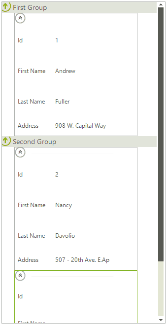

# Unbound Mode

## Design Time Adding Items

Unbound data cane be populated in the Visual Studio designer by using the __Edit Columns__ and __Edit Items__ groups of the control`s Smart Tag. The value of the label is determined by the __HeaderText__ property of the column. Each of the added items exposes a __SubItems__ collection which can be filled with sting data corresponding to each of the columns. The short video below sets up the control with one __CardViewItem__ having four columns and four editor values.

>caption Fig. 1: Add Items at Design Time


After you run the application the result should be similar to the following image.

>caption Fig. 2: Added Items at Design Time


## Populating Data Programatically

__RadCardView__ can also be set up to display data added at run-time. The following example will also demonstrate how custom grouping can be achieved. 

>caption Fig. 3: Add Grouped Items at Run Time

### Adding Columns

The columns of __RadCardView__ are stored in a collection that is accessible through the __Columns__ property. Columns can be added to __RadCardView__ using one of the three overloads of the __Add__ method as it is shown below. Each column must have unique name because columns are distinguished by their __Name__ property. 

#### Adding columns

{{source=..\SamplesCS\CardView\CardViewUnboundMode.cs region=AddColumns}} 
{{source=..\SamplesVB\CardView\CardViewUnboundMode.vb region=AddColumns}}
````C#
this.radCardView1.Columns.Add("Id");
this.radCardView1.Columns.Add("Column2", "First Name");
this.radCardView1.Columns.Add(new ListViewDetailColumn("Column3", "Last Name"));
this.radCardView1.Columns.Add("Address");

````
````VB.NET
Me.RadCardView1.Columns.Add("Id")
Me.RadCardView1.Columns.Add("Column2", "First Name")
Me.RadCardView1.Columns.Add(New ListViewDetailColumn("Column3", "Last Name"))
Me.RadCardView1.Columns.Add("Address")

```` 


{{endregion}} 

### Adding Items and Populating Cells

The items of __RadCardView__ are stored in a collection that is also accessible through its __Items__ property. Items can be added to __RadCardView__ using one of the overloads of the __Add__ method. You can set cell values to the items of __RadCardView__ using their indexers. The keys can be either the index of the column, the name of the column, or the column itself.

#### Adding items

{{source=..\SamplesCS\CardView\CardViewUnboundMode.cs region=AddItems}} 
{{source=..\SamplesVB\CardView\CardViewUnboundMode.vb region=AddItems}} 

````C#
this.radCardView1.Items.Add(new ListViewDataItem("First CardViewItem"));
this.radCardView1.Items.Add("2", "Nancy", "Davolio", "507 - 20th Ave. E.Apt. 2A");
this.radCardView1.Items.Add("Third CardViewItem");

````
````VB.NET
Me.RadCardView1.Items.Add(New ListViewDataItem("First CardViewItem"))
Me.RadCardView1.Items.Add("2", "Nancy", "Davolio", "507 - 20th Ave. E.Apt. 2A")
Me.RadCardView1.Items.Add("Third CardViewItem")

````

{{endregion}} 

#### Populating cells

{{source=..\SamplesCS\CardView\CardViewUnboundMode.cs region=PopulateCells}} 
{{source=..\SamplesVB\CardView\CardViewUnboundMode.vb region=PopulateCells}}
````C#
ListViewDataItem item = this.radCardView1.Items[0];
item[0] = "1";
item["Column2"] = "Andrew";
item[radCardView1.Columns[2]] = "Fuller";
item["Address"] = "908 W. Capital Way";

````
````VB.NET
Dim item As ListViewDataItem = Me.RadCardView1.Items(0)
item(0) = "1"
item("Column2") = "Andrew"
item(RadCardView1.Columns(2)) = "Fuller"
item("Address") = "908 W. Capital Way"

```` 


{{endregion}} 

>note To use these indexers the item must have a valid owner e.g. it first has to be added to the __Items__ collection of the __RadCardView__.
>

## Adding Groups

Aside from using __GroupDescriptors__, custom groups can also be added to __RadCardView__. This is done by using the __Add__ method of the __Groups__ collection of RadListView.

#### Adding groups

{{source=..\SamplesCS\CardView\CardViewUnboundMode.cs region=AddGroups}} 
{{source=..\SamplesVB\CardView\CardViewUnboundMode.vb region=AddGroups}}
````C#
this.radCardView1.EnableGrouping = true;
this.radCardView1.ShowGroups = true;
this.radCardView1.EnableCustomGrouping = true;
this.radCardView1.CardViewElement.ViewElement.Orientation = Orientation.Vertical;
this.radCardView1.Groups.Add(new ListViewDataItemGroup("First Group"));
this.radCardView1.Groups.Add(new ListViewDataItemGroup("Second Group"));

````
````VB.NET
Me.RadCardView1.EnableGrouping = True
Me.RadCardView1.ShowGroups = True
Me.RadCardView1.EnableCustomGrouping = True
Me.RadCardView1.CardViewElement.ViewElement.Orientation = Orientation.Vertical
Me.RadCardView1.Groups.Add(New ListViewDataItemGroup("First Group"))
Me.RadCardView1.Groups.Add(New ListViewDataItemGroup("Second Group"))

```` 


{{endregion}} 

In order to assign an item to a group, you should set the item’s __Group__ property:

#### Assign item to a group

{{source=..\SamplesCS\CardView\CardViewUnboundMode.cs region=AssignItemToAGroup}} 
{{source=..\SamplesVB\CardView\CardViewUnboundMode.vb region=AssignItemToAGroup}}
````C#
this.radCardView1.Items[0].Group = this.radCardView1.Groups[0];
this.radCardView1.Items[1].Group = this.radCardView1.Groups[1];
this.radCardView1.Items[2].Group = this.radCardView1.Groups[1];

````
````VB.NET
Me.RadCardView1.Items(0).Group = Me.RadCardView1.Groups(0)
Me.RadCardView1.Items(1).Group = Me.RadCardView1.Groups(1)
Me.RadCardView1.Items(2).Group = Me.RadCardView1.Groups(1)

```` 


{{endregion}} 

In order to enable this kind of grouping the __EnableCustomGrouping__ property needs to be set to *true*. In order to display the groups the __ShowGroups__ property needs to be set to *true*.
		

