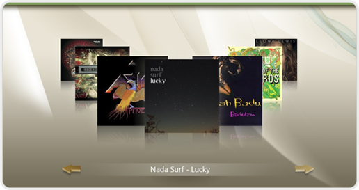

# Carousel

## 

| RELATED VIDEOS |  |
| ------ | ------ |
|[Overview of RadCarousel for WinForms](http://tv.telerik.com/watch/winforms/radcarousel/overview-radcarousel-winforms)
 See how to quickly get started using the Telerik RadCarousel for WinForms. (Runtime: 07:18)||
>caption 
 
RadCarousel is a navigation control that animates a series of elements either by the user clicking a particular element or by clicking the forward and back arrows. Based on top of the Telerik Presentation Framework (TPF), RadCarousel supports databinding, smooth animations and transitions, automatic generation of image reflections and dynamic addition and removal of items. 
