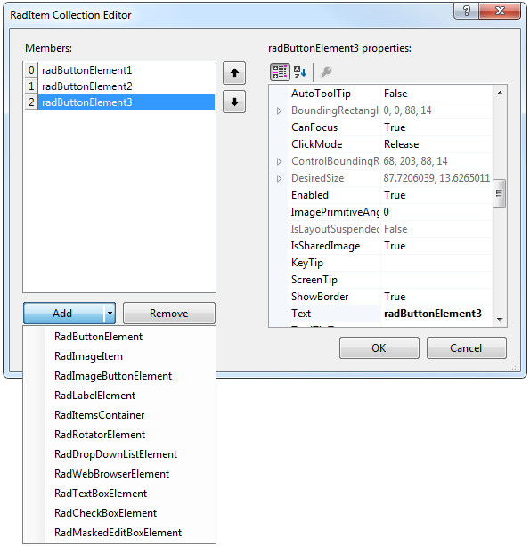

# Adding Carousel Items

## 

You can add carousel items using the Visual Studio designer. Open the __RadCarousel__ Smart Tag and choose Edit Items command.

>caption 

The __RadItem__ collection editor will open, where you can add different types of __RadElements__: 

>caption 

You can add as many items as you want. Use the __Up__ and __Down__ buttons next to the items list to change the order of the items. 

Use the properties editor to set item-specific properties such as __ToolTip__, caption (__Text__ property), etc.

