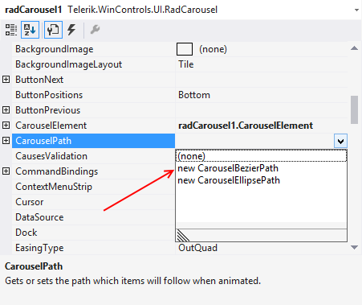

# Setting Ellipse Path Design-time

## 

You can set the bezier path for the carousel using the Visual Studio designer. 

1. Drag the __RadCarousel__ control in your form. 

2. In Properties, set __CarouselPath__ to __newCarouselEllipsePath__

>caption 

3. Drag the two control points (__U__ and __V__) and the center point to set the ellipse as desired:

>caption 

>note  __Note__ : You can arrange the points only in 2D. The Z coordinate (if needed) should be set programmatically.
>

You can revert the rotating direction (when __AutoLoop__ is set to __true__) by swapping the __V__and __U__ points positions. The rotation is alway from __V__ to __U__ point. 

You can drag the ellipse points over the whole designer area, i.e. you are not limited to the form only. 
