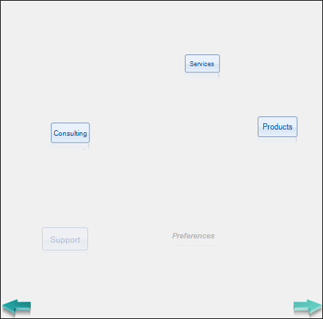

# Getting Started


## 


|RELATED VIDEOS|
|Overview of RadCarousel for WinForms See how to quickly get started using the Telerik RadCarousel for WinForms. (Runtime: 07:18)[](http://tv.telerik.com/winforms/radcarousel/overview-radcarousel-winforms)|


The minimum required to use RadCarousel is:

* Create a path instance and assign it. The path defines the route, in three dimensions, that the carousel elements will appear to animate through. For example, you can have an elliptical path thats tilted back on a 45 degree angle. 


* Add to the carousel Items collection.

The example below demonstrates [creating an elliptical path]() and [populating the carousel items]() with several button and one label elements.

1. In a new Windows Application project, add a __RadCarousel__ control to the default form. Set the RadCarousel __Dock__ property to __Fill__. 


1. Add __Telerik.WinControls.UI__ namespace to the "uses" (C#) or "Imports" (VB) section of the code. 


1. Add the following code to the Form_Load event handler:#_[C#] Defining the Path and Populating the Carousel Items_

	


{{source=..\SamplesCS\Carousel\CarouselGettingStarted.cs region=carouselGettingStarted}} 
{{source=..\SamplesVB\Carousel\CarouselGettingStarted.vb region=carouselGettingStarted}} 

````C#
        private void CarouselGettingStarted_Load(object sender, EventArgs e)
        {
             // define an elliptical path
            CarouselEllipsePath path = new CarouselEllipsePath();
            // put the center point of the path in the center of the form
            path.Center = new Telerik.WinControls.UI.Point3D(50, 50, 0);
            path.FinalAngle = -100;
            path.InitialAngle = -90;
            path.U = new Telerik.WinControls.UI.Point3D(-20, -17, -50);
            path.V = new Telerik.WinControls.UI.Point3D(30, -25, -60);
            this.radCarousel1.CarouselPath = path;
            // populate carousel items
            radCarousel1.Items.Add(new RadButtonElement("Products"));
            radCarousel1.Items.Add(new RadButtonElement("Services"));
            radCarousel1.Items.Add(new RadButtonElement("Consulting"));
            radCarousel1.Items.Add(new RadButtonElement("Support"));
            RadLabelElement label = new RadLabelElement();
            label.Text = "Preferences";
            label.Font = new Font("Arial", 7, FontStyle.Italic | FontStyle.Bold);
            radCarousel1.Items.Add(label);
        }
````
````VB.NET
    Private Sub CarouselGettingStarted_Load(ByVal sender As System.Object, ByVal e As System.EventArgs) Handles MyBase.Load
        ' define an elliptical path
        Dim path As New CarouselEllipsePath()
        ' put the center point of the path in the center of the form
        path.Center = New Point3D(50, 50, 0)
        path.InitialAngle = -100
        path.FinalAngle = -90
        path.U = New Point3D(-20, -17, -50)
        path.V = New Point3D(30, -25, -60)
        radCarousel1.CarouselPath = path
        ' populate carousel items
        radCarousel1.Items.Add(New RadButtonElement("Products"))
        radCarousel1.Items.Add(New RadButtonElement("Services"))
        radCarousel1.Items.Add(New RadButtonElement("Consulting"))
        radCarousel1.Items.Add(New RadButtonElement("Support"))
        Dim label As New RadLabelElement()
        label.Text = "Preferences"
        label.Font = New Font("Arial", 7, FontStyle.Italic Or FontStyle.Bold)
        radCarousel1.Items.Add(label)
    End Sub
    '
````

{{endregion}} 


1. Press __F5__ to run the application.
