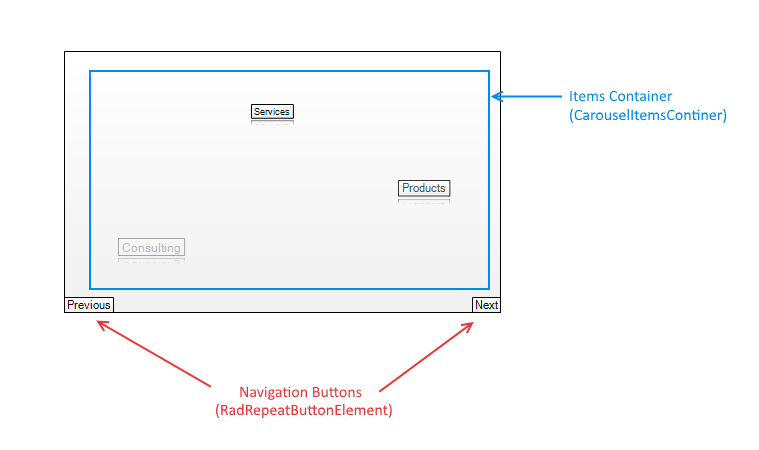
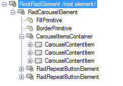

# Structure

The bellow image shows the __RadCaroucel__ elements:

# Element structure 

__RadCarosel__ consist of the following elements: 

* __Items Container__ the container which holds the items.
* __Navigation Buttons__ These buttons allows you to change the current item.

