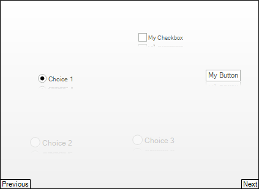

# Carousel Items
 
You can add to __RadCarousel__ control by using the __Items__ collection (programmatically or design-time), or by [binding to a data source](). You can use __RadItem__ descendants to populate the __RadCarousel.Items__ collection, for example __RadLabelElement__ or __RadButtonElement__.

## Adding Carousel Items

To add items to the carousel without [data binding](), use the __Add__ method of the carousel collection. The example below adds a number of different RadItem types.



#### Adding Carousel Items 

{{source=..\SamplesCS\Carousel\CarouselItems.cs region=carouselItems}} 
{{source=..\SamplesVB\Carousel\CarouselItems.vb region=carouselItems}} 

````C#
radCarousel1.Items.Add(new RadButtonElement("My Button"));
RadCheckBoxElement checkbox = new RadCheckBoxElement();
checkbox.Text = "My Checkbox";
radCarousel1.Items.Add(checkbox);
RadRadioButtonElement radio1 = new RadRadioButtonElement();
radio1.Text = "Choice 1";
radio1.ToggleState = ToggleState.On;
RadRadioButtonElement radio2 = new RadRadioButtonElement();
radio2.Text = "Choice 2";
RadRadioButtonElement radio3 = new RadRadioButtonElement();
radio3.Text = "Choice 3";
radCarousel1.Items.Add(radio1);
radCarousel1.Items.Add(radio2);
radCarousel1.Items.Add(radio3);

````
````VB.NET
RadCarousel1.Items.Add(New RadButtonElement("My Button"))
Dim checkbox As New RadCheckBoxElement()
checkbox.Text = "My Checkbox"
RadCarousel1.Items.Add(checkbox)
Dim radio1 As New RadRadioButtonElement()
radio1.Text = "Choice 1"
radio1.ToggleState = ToggleState.On
Dim radio2 As New RadRadioButtonElement()
radio2.Text = "Choice 2"
Dim radio3 As New RadRadioButtonElement()
radio3.Text = "Choice 3"
RadCarousel1.Items.Add(radio1)
RadCarousel1.Items.Add(radio2)
RadCarousel1.Items.Add(radio3)

````

{{endregion}} 
 

## Adding Carousel Items in Visual Studio design-time

You can add carousel items using the Visual Studio designer. Open the __RadCarousel__ Smart Tag and choose Edit Items command.


The __RadItem__ collection editor will open, where you can add different types of __RadElements:__

## 

Deleting Carousel Items

To delete an entry from the carousel Items collection, use the __Remove__ or __RemoveAt__ methods. Remove takes the __RadItem__ instance to be deleted and __RemoveAt__ takes the index position of the item to be deleted:
        
#### Deleting Carousel Items 

{{source=..\SamplesCS\Carousel\CarouselItems.cs region=carouselDeletingItems}} 
{{source=..\SamplesVB\Carousel\CarouselItems.vb region=carouselDeletingItems}} 

````C#
radCarousel1.Items.Remove(radCarousel1.Items[0]);
radCarousel1.Items.RemoveAt(0);

````
````VB.NET
RadCarousel1.Items.Remove(RadCarousel1.Items(0))
RadCarousel1.Items.RemoveAt(0)

````

{{endregion}} 


