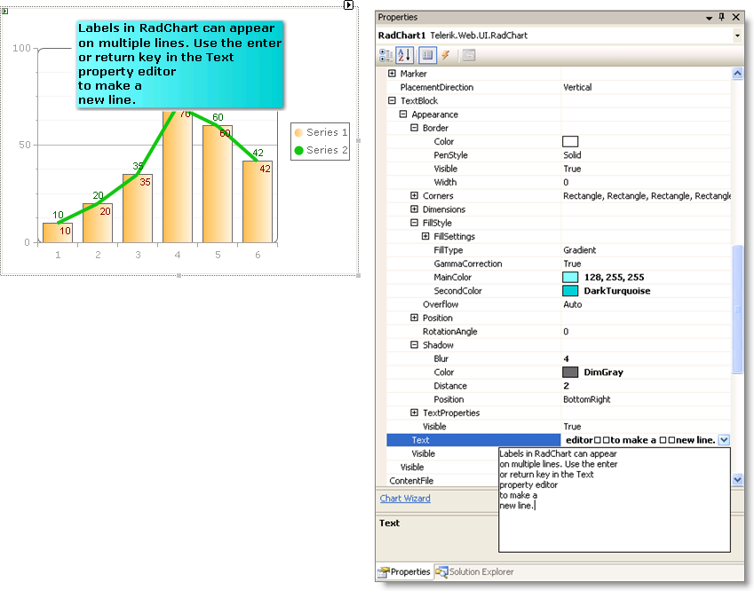

# Multi-Line Labels

## 

Labels in RadChart can appear on multiple lines.  The property editor for __TextBlock__.__Text__ properties allows you to hit the enter key to start a new line. Press control-enter to accept the text and close the property editor.

