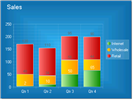
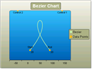
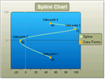
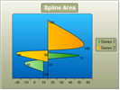
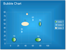
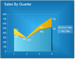

# RadChart Types Overview

## 

There are 17 chart types: 

<table><tr><td>

<b>
               Chart Type</b></td><td></td><td>

<b>Description</b></td><td>

<b>When to use</b></td></tr><tr><td>

[Bar]()</td><td></td><td>

Bar charts graphically display values in vertical and horizontal bars across categories.</td><td>

Bar charts are useful for comparing multiple series of data  (i.e. providing snapshots of data at particular points in time).</td></tr><tr><td>

[Stacked Bar]()</td><td></td><td>

Stacked Bar charts are used to compare contributions of values to a total across categories</td><td>

Use the Stacked Bar chart when you need visibility to the combined values for each category.</td></tr><tr><td>

[Stacked Bar 100%]()</td><td></td><td>

Stacked Bar 100% shows the combined contribution of values as percentages where the combined total for each category is 100 percent. </td><td>

Use when the relationship between values in a category is more significant than the amounts.</td></tr><tr><td>

[Pie]()</td><td></td><td>

The Pie chart shows slices representing fractional parts of a whole.</td><td>

When you need to display the contribution of fractional parts to a whole.</td></tr><tr><td>

[Gantt]()</td><td></td><td>

Gantt charts, also known as Time charts, display separate events as bars along a time scale.</td><td>

These charts are often used for project/time planning, where data can be plotted using a date-time scale or other numeric scale.</td></tr><tr><td>

[Bezier]()</td><td></td><td>

The Bezier chart displays a series of points on a curved line.  Two "control points" determine the position and amount of curvature in the line between end points</td><td>

The Bezier chart is often used for data modeling by taking a limited number of data points and interpolating or estimating the intervening values. </td></tr><tr><td>

[Spline]()</td><td></td><td>

Spline charts allow you to take a limited set of known data points and approximate intervening values.</td><td>

The Spline chart, like the Bezier, is often used for data modeling by taking a limited number of data points and interpolating or estimating the intervening values. </td></tr><tr><td>

[Spline Area]()</td><td></td><td>

The Spline Area chart type defines one or more spline curves and fills in the area defined by the spline.</td><td>

Also can be used for data modeling in that it takes a limited number of data points and interpolates the intervening values. This chart type also emphasizes the area between the spline curve and a mid-point of the spline. </td></tr><tr><td>

[Stacked Spline Area]()</td><td></td><td>

The Stacked Spline Area chart is a variation of the Spline Area chart. The areas are stacked so that each series adjoins but does not overlap the preceding series. </td><td>

Also can be used for data modeling in that it takes a limited number of data points and interpolates the intervening values. This chart type allows the entire surface area for all sequences to be displayed at one time.</td></tr><tr><td>

[Stacked Spline Area 100%]()</td><td></td><td>

The Stacked Spline Area 100% chart is a variation of the Spline Area chart. The areas are stacked so that each series adjoins but does not overlap the preceding series and where the combined total for each category is 100 percent.</td><td>

Also can be used for data modeling in that it takes a limited number of data points and interpolates the intervening values. This chart type allows the entire surface area for all sequences to be displayed at one time. Use this chart type when the relationship between values in a category is more significant than the amounts.</td></tr><tr><td>

[Point]()</td><td></td><td>

Point or "Scatter" charts are used to show correlations between two sets of values. </td><td>

The Point chart is often used for scientific data modeling or financial data.  Typically not used used with time dependent data where a Line chart is more suited. </td></tr><tr><td>

[Bubble]()</td><td></td><td>

The Bubble chart is an extension of the Point chart but each point can be a circle or oval of any size or dimension. The bubble size may be used to convey larger values.</td><td>

The Bubble chart is often used for scientific data modeling or financial data.</td></tr><tr><td>

[Line]()</td><td></td><td>

This chart type displays a set of data points connected by a line.</td><td>

A common use for the line chart is to show trends over a period of time.</td></tr><tr><td>

[Area]()</td><td></td><td>

The Area chart consists of a series of data points joined by a line and where the area below the line is filled</td><td>

Area charts are appropriate for visualizing data that fluctuates over a period of time and can be useful for emphasizing trends. </td></tr><tr><td>

[Stacked Area]()</td><td></td><td>

The Stacked Area chart is a variation of the Area chart that display trends of the contribution of each value over time (or across categories). The areas are stacked so that each series adjoins but does not overlap the preceding series.  </td><td>

Area charts are appropriate for visualizing data that fluctuates over a period of time and where the entire area for all series data must be visible at one time.</td></tr><tr><td>

[Stacked Area 100%]()</td><td></td><td>

Stacked Areas 100% charts are a variation of Stacked Area charts that present values for trends as percentages, totaling to 100% for each category. </td><td>

Use this chart type to visualize data that fluctuates over a period of time and where the relationship between values in a category is more significant than the amounts.</td></tr><tr><td>

[CandleStick]()</td><td></td><td>

The CandleStick chart combines bar and line chart styles to show a range of value movement over time. Dark colored bars show downward trends, light colored bars show upward trends and the line through the center (the "wick") shows the extreme high and low values. </td><td>

Use this chart type to visualize price or currency fluctuations.  Typically this chart is used to analyze stock prices or currency changes.</td></tr></table>

