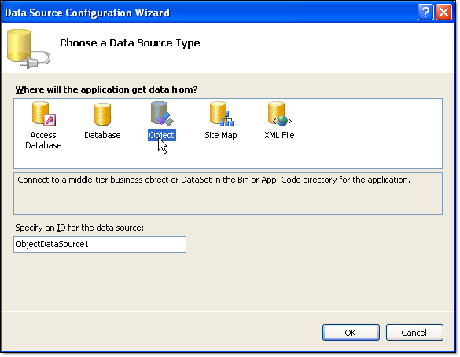
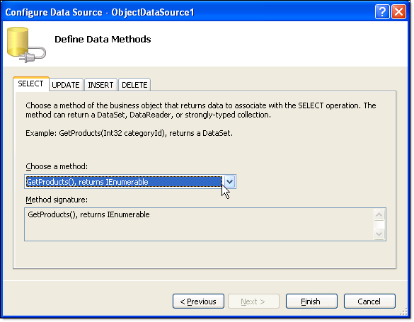

# Data Binding RadChart to ObjectDataSource at Design-Time

## 

Use the Data Source Configuration Wizard to bind [ObjectDataSource](http://msdn2.microsoft.com/en-us/library/system.web.ui.webcontrols.objectdatasource.aspx)  at design time:  

1. Click the RadChart [Smart Tag]() *Choose Data Source* | *< New Data Source >*. 

	>caption 

	

1. From the "Choose a data source type" page of the wizard select "Object" and click "OK". 

	>caption 

	

1. From the "Choose a Business Object" page of the wizard, select your business object from the drop down list.  Click Next. 

	>caption 

	

1. On the "Define data methods" page choose the select method from the drop down list.  Click Finish.  A new [ObjectDataSource](http://msdn2.microsoft.com/en-us/library/system.web.ui.webcontrols.objectdatasource.aspx) component will be visible on the page and the RadChart __DataSource__ property will point to it. 

	
