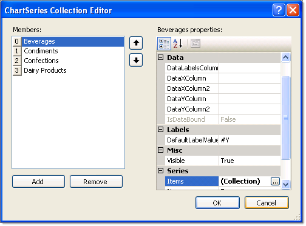

# Populate RadChart at Design-Time

## 

__RadChart__ provides two collection editors: ChartSeries Collection Editor and __ChartSeriesItem Collection Editor__. They allow you to easily create series and items, and set the relevant properties without writing any code.  

There are two basic steps to populate the RadChart with data:

1. Click on the RadChart __Series__ property ellipses to display the ChartSeries Collection Editor. Here you can add or remove series in the Members list box on the left side of the editor. You can set the series level properties by selecting a series member and editing properties in the properties window located on the right hand side of the editor. See topics [Series Overview](), [Series Items]() and [Series-Specific Properties]() for more information. Note the __Items__ property under the __Series__ property category. 
	>caption 

	

1. Click the __Items__ property ellipses of a series to display the __ChartSeriesItem Collection Editor__. Here you can add or remove items in the Members list box on the left side of the editor.  Select __ChartSeriesItem__ objects in the Members list box on the left side of the editor. You can set item properties by selecting an item member and editing properties in the properties window located on the right hand side of the editor. Set the values for each item using the properties under the "Basic value set" property category. See [Series Items]() for more information.
	>caption 

	

The running application shows __ChartSeries__ members in the Legend and __ChartSeriesItem__ as bars in the plot area.  

>note This chart example also displays customization in the legend and axis labels. See [Legends]() and [Axis Labels]() for more information.
	

>caption 
