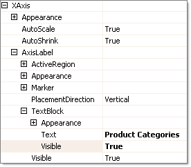

# Quick Start: Create a Bar Chart with Simple Static Data

This Quick Start tutorial is designed to have you quickly up and running with a working RadChart application.
        	In the process of creating a basic bar chart you will be introduced to some of the features of RadChart. 
        	You will populate the chart with static data and modify several properties that affect chart appearance.
        

## Create a Windows Application

1. From the Visual Studio __File__ menu select __New | Project__.   

1. Select the "Windows Application" and enter a location path for the project.

1. From the Toolbox drag a RadChart component to the form. The project should now look like the figure below.

## Populate Chart Data

1. Click the RadChart's SmartTag.

1. From the SmartTag "Data" section, click the ellipses for the Chart Series Collection.

1. Click "Series 1" in the members list on the left, then locate the __Name__ property in the property window.

1. Change the __Name__ property to "Sales" and the __DefaultLabelValue__ to "#ITEM". __Name__ 
				  	will be the series name that shows up in the legend. __DefaultLabelValue__ will display the name of each item in the 
				  	series instead of the item value.
          

1. Locate the __Items__ property in the property window.

1. Click the ellipses button of the __Items__ property to open the __ChartSeriesItem Collection Editor__.

1. Click the __Add__ button to add a new Item.

1. In the property window for the new item, change the __Name__ property to "Beverages".

1. Change the YValue property to "10000".
            

1. Repeat the Add Item steps to add 3 new items.

1. Replace the properties for the three new items as follows.:

* __Label__=Produce, __YValue__ =7500

* __Label__=Poultry, __YValue__ =9000

* __Label__=Grains, __YValue__ =11200   

1. Click __OK__ to close the __ChartSeriesItem Collection Editor__.

1. Click "Series 2" in the __ChartSeries Collection Editor__.

1. Click the __Remove__ button to remove Series 2.

1. Click the __OK__ button to close the __ChartSeries Collection Editor__.

1. The chart will display the new data using the default formatting.
          

## Format the Chart Using the SmartTag

1. Click the RadChart's Smart Tag

1. Change the Layout section __Height__ to 400px.

1. In the __Appearance__ section, change the __Title Text__ entry to "Category Sales".

1. The SmartTag options and resulting chart should look like the screen shot below.

## Format the Chart

1. Click the __Chart Wizard__ link at the bottom of the RadChart Tasks menu.

1. Click the __Axis__ Tab.

1. Locate the __Visual Properties__ section of the __Axis__ tab.

1. On the __Select Axis drop down__list select the X Axis. In the __Axis Title__entry enter 
				  	"Product Categories". Uncheck __Show Ticks__to remove the tick marks from the bottom of the chart.

1. On the __Select Axis drop down__list select the Y Axis. Uncheck __Show Ticks__to remove the tick marks on the left hand side of the chart.
            

1. Click the __Labels, Legend and Title__ tab

1. Locate the __Legend__ section.

1. Uncheck the __Visible__ check box. This will remove the Sales legend from the right side of the graph
            

1. On the __Skins__ tab select the __Deep Blue__ skin.
            

1. Click the __OK__ button to close the wizard.

1. In the properties window, locate __PlotArea.XAxis.AxisLabel.TextBlock.Visible__and set it to "True".

Run the application to view the finished chart.  It should look like the screen shot shown below. 
