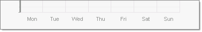

# How Do I add Axis Labels Programmatically?

## 

To add labels along an Axis programmatically:

* Set AutoScale to false.

* Add a range of items to the axis.

* Populate the Items.

#### __[C#] Add Axis labels__

{{region addAxisLabels}}
	            radChart1.PlotArea.XAxis.AutoScale = false;
	            radChart1.PlotArea.XAxis.AddRange(1, 7, 1);
	            radChart1.PlotArea.XAxis[0].TextBlock.Text = "Mon";
	            radChart1.PlotArea.XAxis[1].TextBlock.Text = "Tue";
	            radChart1.PlotArea.XAxis[2].TextBlock.Text = "Wed";
	            radChart1.PlotArea.XAxis[3].TextBlock.Text = "Thu";
	            radChart1.PlotArea.XAxis[4].TextBlock.Text = "Fri";
	            radChart1.PlotArea.XAxis[5].TextBlock.Text = "Sat";
	            radChart1.PlotArea.XAxis[6].TextBlock.Text = "Sun";
	{{endregion}}

#### __[VB.NET] Add Axis labels__

{{region addAxisLabels}}
	        radChart1.PlotArea.XAxis.AutoScale = False
	        radChart1.PlotArea.XAxis.AddRange(1, 7, 1)
	        radChart1.PlotArea.XAxis(0).TextBlock.Text = "Mon"
	        radChart1.PlotArea.XAxis(1).TextBlock.Text = "Tue"
	        radChart1.PlotArea.XAxis(2).TextBlock.Text = "Wed"
	        radChart1.PlotArea.XAxis(3).TextBlock.Text = "Thu"
	        radChart1.PlotArea.XAxis(4).TextBlock.Text = "Fri"
	        radChart1.PlotArea.XAxis(5).TextBlock.Text = "Sat"
	        radChart1.PlotArea.XAxis(6).TextBlock.Text = "Sun"
	{{endregion}}

