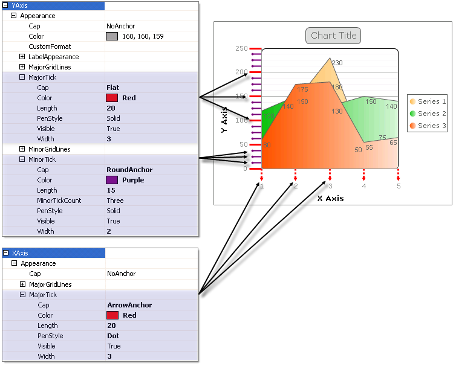

# Ticks

Axis ticks are the small marks that identify the position of items on the axes and the starting points of gridlines. 

Vertical ticks are controlled by the __XAxis__ and horizontal ticks are controlled by __YAxis__ and __YAxis2__. Ticks can be "major", e.g. falling on the labeled axis __Step__ values.  "Minor" ticks fall between __Step__ values for __YAxis__ and __YAxis2__. See the figure below where major ticks fall on 50, 100, 150, 200, 250 of the __YAxis__ and minor ticks fall between the major ticks. 
>caption 

To control the visibility and general appearance of gridlines use the the PlotArea.<axis>.Appearance property to reach __MajorTick__ and __MinorTick__ properties.  __XAxis__ has only a __MajorTick__ property while __YAxis__ and __YAxis2__ have both __MajorTick__ and __MinorTick______properties.  Both major and minor tick objects include the following properties: 

* __Visible____:__Set this property false to hide the ticks. 

* __Cap____:__The terminator for each tick can be __Flat__, __Square__, __Round__, __Triangle__, __NoAnchor__, __SquareAnchor__, __DiamondAnchor__, __ArrowAnchor__, __AnchorMask__or __Custom__. In the example above the Y Axis major ticks have a __Square__cap, minor ticks have a __RoundCap__ and X Axis major ticks have an __ArrowAnchor__cap.   

* __Color__ of the line and cap. 

* __Length__: The length of the tick in pixels.  To reverse the direction of the ticks and have them appear above the axis line use a negative value for __Length__. 

* __PenStyle____:__values can be__Solid__, __Dash__, __Dot__, __DashDot__, __DashDotDot__ and __Custom__. 

* __Width__ in pixels__.__ 

## Layout

The __LayoutMode__property of each the X axis object specifies how axis marks are positioned with regard to series items. Layout modes change the chart appearance while the underlying data remains the same.. The available __LayoutMode__ values are __Normal__, __Inside__and __Between__. 
>caption 

