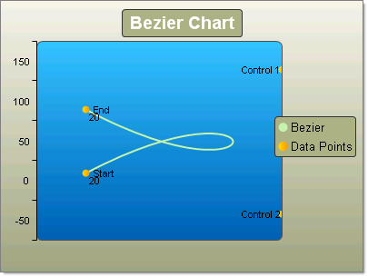

# Bezier Charts

## 

The Bezier chart is often used for modeling data by interpolating data points, through which curved lines pass. 

To draw a Bezier chart series you add (1 + 3 x N) items to a series.  So you can have 4 data points or 7, 10, 13, etc.  The simplest set of data would be 4 data points: two end points and two "control points" that control the position and amount of curvature in the line between the two end points.  See the figures below for examples. Each of the data points must have a X and Y value. 

To create a simple vertical Bezier Chart set the __SeriesOrientation__ property to __Vertical__. Set the RadChart __DefaultType__ property or __ChartSeries.Type__ to __Bezier__. Create a series and add four chart items with X and Y values.

>note The second chart series labeled "Data Points" is included to emphasize the location of the end and control points in the Bezier series.
>

>caption 

To create a simple horizontal Bezier Chart set the __SeriesOrientation__ property to __Horizontal__. Set the RadChart __DefaultType__ property or __ChartSeries.Type__ to __Bezier__. Create a series and add four chart items with X and Y values.

| __YValue__ | __XValue__ |
|----|----|
|20|50|
|20|100|
|80|100|
|80|50|

>caption 

| __YValue__ | __XValue__ |
|----|----|
|20|50|
|50|100|
|80|100|
|80|50|
>caption 

