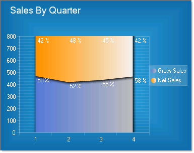

# Stacked Area 100% Charts

## 

Stacked Areas 100% charts are a variation of Stacked Area charts that present values for trends as percentages, totaling to 100% for each category

To create a Vertical Stacked Area 100% Chart set the __SeriesOrientation__ property to __Vertical__. Set the RadChart __DefaultType__ property or __ChartSeries.Type__ to __StackedArea100__.

To create a Horizontal Stacked Area 100% Chart set the __SeriesOrientation__ property to __Horizontal__. Set the RadChart __DefaultType__ property or __ChartSeries.Type__ to __StackedArea100__.

To display the label values as percentages, change the __DefaultLabelValue__ for each chart series from "#Y" (the numeric value for each data point) to "#%" (the percentage of each data point to the category).
        
