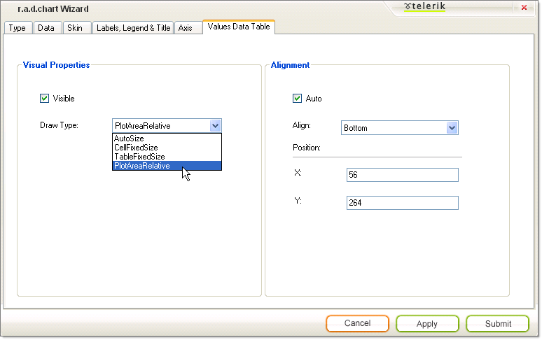

# Understanding Wizard Values Data Table Tab

The __Values Data Table__tab of the Wizard controls the general look and positioning of the [chart data table](269499D0-9C06-4CAE-93C5-3795AA892331). 

## Visual Properties

* Check __Visible__to display the chart data table.  By default this is unchecked.

* Select Draw Type from the drop down list to control the general size and positioning of the chart.  Select __AutoSize__ to have each cell size to the data inside of it.  __PlotAreaRelative__ places each cell just below the chart series item it represents. __CellFixedSize__and __TableFixedSize__fix the size of the cells or table irrespective of the data it contains.

## Alignment

Use the __Align__drop down list to place the chart data table in a predefined position (e.g. Top, Bottom, BottomRight, etc.)  To place the data table at exact coordinates, uncheck __Auto__ and enter values for __X__and __Y__.
>caption 

As a result you will get the following chart:
>caption 

